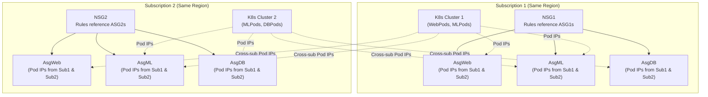
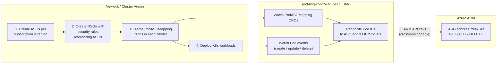
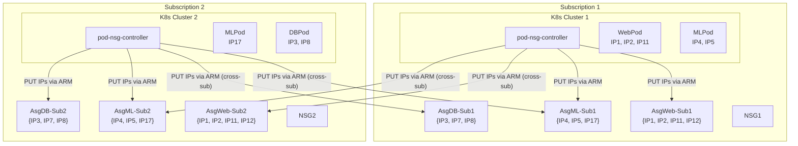
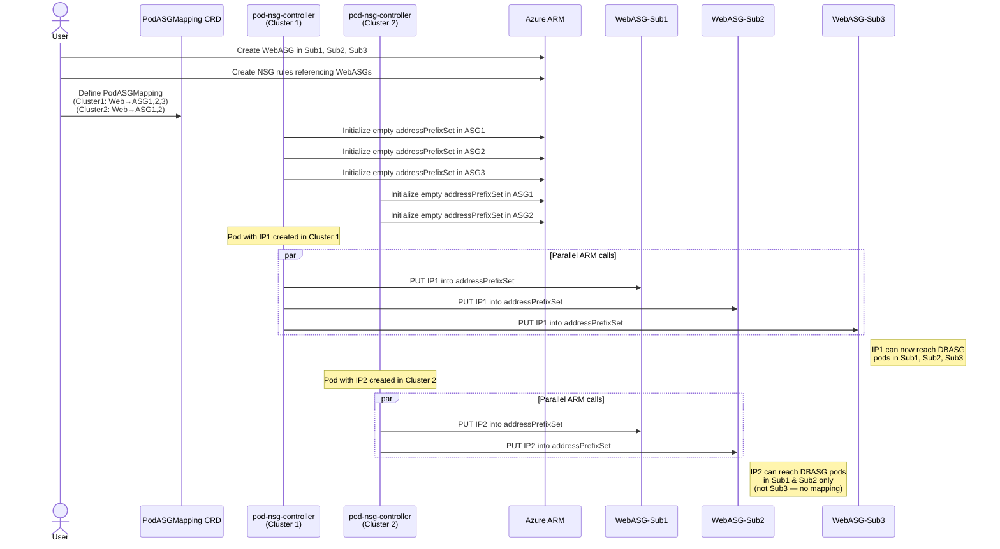
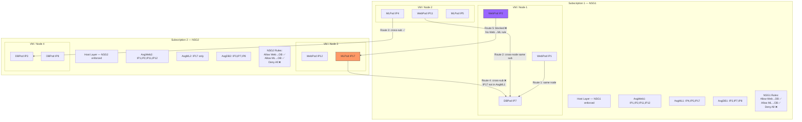

# Comprehensive Design Document and User Guide

## Contents

- [Dynamic Pod ASGs Overview](#dynamic-pod-asgs-overview)
- [1. Dynamic Pod ASGs – Feature Details](#1-dynamic-pod-asgs--feature-details)
  - [1.1 Template/API Sample](#11-templateapi-sample)
- [2. Dynamic Pod ASGs – Cross-Subscription Behavior](#2-dynamic-pod-asgs--cross-subscription-behavior)
  - [2.1 Stripe's Scenarios](#21-stripes-scenarios)
  - [2.2 Scale & Latency](#22-scale--latency)
- [3. Customer Experience](#3-customer-experience)
  - [3.1 User Interactions and Controller Flow](#31-user-interactions-and-controller-flow)
  - [3.2 NSG and ASG Setup](#32-nsg-and-asg-setup)
  - [3.3 Azure and K8s Cluster Setup](#33-azure-and-k8s-cluster-setup)
  - [3.4 Pod Deployment to ASG Mapping CRD definition](#34-pod-deployment-to-asg-mapping-crd-definition)
- [4. Controller Design](#4-controller-design)
  - [4.1 Sample deployment](#41-sample-deployment)
  - [4.2 Controller Flow Sequence Diagram with ASG Updates (IP Provisioning Flow)](#42-controller-flow-sequence-diagram-with-asg-updates-ip-provisioning-flow)
    - [4.2.1 IP Provisioning Sequence Diagram](#421-ip-provisioning-sequence-diagram)
    - [4.2.2 Datapath Flow and Security Rules Application](#422-datapath-flow-and-security-rules-application)
    - [4.2.3 Datapath Routes (All routes are numbered at each step)](#423-datapath-routes-all-routes-are-numbered-at-each-step)
- [5. Milestone Checkpoints](#5-milestone-checkpoints)

---

## Dynamic Pod ASGs Overview

"Dynamic Pod ASGs" project for Stripe extends ASGs to support direct pod IP address and IP prefix associations, enabling Kubernetes pod IPs to be associated with ASGs. This allows NSGs to enforce security policies consistently for Kubernetes workloads using the same ASG-based model used for Azure VM workloads.

This design supports Stripe's requirements for Kubernetes pod-to-pod and pod-to-VM traffic while preserving Azure's subscription-scoped and region-scoped NSG enforcement model. Note that NSGs are regional resources and can only reference ASGs in the same region. Expansion beyond how NSGs and ASGs currently operate within subscription and regional boundaries is not committed as part of this design.

## 1. Dynamic Pod ASGs – Feature Details

- **For Stripe:** ASGs are extended to support direct IP address and prefix associations.
- **Address prefix sets support:**
  - Individual IPs (for example, x.x.x.x/32)
  - CIDR prefixes
- These IPs are free-form and are not constrained by subscription, VNet, or region.
  - However, an ASG used in an NSG rule must be in the same subscription and region as that NSG. This is the current behavior supported today.
- An ASG can contain multiple IPs/prefixes per set. So an ASG can represent K8 pods regardless of placement, but the ASG will need to be recreated per region and per subscription where an NSG is desired.
- For example, within an ASG, you will be able to add one or more free-form IP address prefixes to the address prefix set. Below is a sample of address prefix set resource ARM response would look like:

### 1.1 Template/API Sample

```json
{
  "name": "myAsg/aks-pod-group-1",
  "type": "Microsoft.Network/applicationSecurityGroups/addressPrefixSet",
  "properties": {
    "IpAddresses": [
      "10.244.0.33/32",
      "10.244.1.33/32"
    ]
  }
}
```

**Restriction:** ASGs for Kubernetes pods/deployments must be maintained separately from ASGs used for VM NICs. Mixing pod IPs and VM NICs in the same ASG will not be supported.

## 2. Dynamic Pod ASGs – Cross-Subscription Behavior

- ASGs can associate with K8 pod IP addresses originating from the same or different subscriptions using address prefix sets.
- This enables a single logical ASG (for example, a webserver tier such as AsgWeb) to represent pods running across multiple subscriptions, VNets, and regions.
- **Restriction:** NSGs remain subscription-scoped and region-scoped and can only reference ASGs within the same subscription and region.
- **In summary:**
  - ASG membership of pod IPs is region- and subscription-agnostic.
  - Security enforcement occurs where the NSG is applied within its subscription and region only.
- Below diagram provides a visual representation for multiple subscriptions, assuming ASGs are in the same region as the NSG for each subscription.



### 2.1 Stripe's Scenarios

**Cross-Subscription Scenario Mapping**

| Stripe Scenario | ASG Pod IP Association | NSG Enforcement |
|---|---|---|
| K8s pod → K8s pod (same VNet) | Supported | Supported |
| K8s pod → K8s pod across two K8 clusters (peered VNets, same or different region) | Supported - Pod IPs regardless of subscription supported. | Supported. **Restriction:** NSG cannot reference ASGs defined in another subscription or region. (Duplicate NSG and ASG required across region/subscription) |
| Raw VM → K8s pod (same or peered VNets, same or different region) | Supported - Pod IPs regardless of subscription supported. | Supported. **Restriction:** NSG cannot reference ASGs defined in another subscription or region. (Duplicate NSG and ASG required across region/subscription) |
| K8s pod → Raw VM (same or peered VNets, same or different region) | Supported - Pod IPs regardless of subscription supported. | Supported. **Restriction:** NSG cannot reference ASGs defined in another subscription or region. (Duplicate NSG and ASG required across region/subscription) |

### 2.2 Scale & Latency

- **ASG scale limits**
  - Up to 3,000 ASGs per subscription
  - Up to 20 ASGs can be associated to a VM NIC IP configuration
  - Up to 10 ASGs can be referenced as a source/destination per NSG rule
  - Up to 4,000 IP configurations and/or prefixes can be referenced by an ASG
- **NSG scale limits**
  - Up to 5,000 NSGs per subscription
  - Up to 1,000 security rules per NSG
  - Up to 4,000 IP addresses and ranges specified for each source and destination in an NSG
  - Up to 100 ASGs can be specified within all security rules of an NSG
- **ASG to IP addresses and ranges SLO target:** ~10 seconds

## 3. Customer Experience

### 3.1 User Interactions and Controller Flow



### 3.2 NSG and ASG Setup

A network administrator creates the following per (subscription and region combination) where they intend to deploy K8s clusters:

- **ASG** representing a logical application tier for their pod IPs
  - E.g., K8 pod for WebPods: AsgWeb; MLPods: AsgML; DatabasePods: AsgDB
- **NSG** and associates it with a subnet being used in the K8s cluster
  - E.g., allow Internet access NsgWeb
- **NSG rules** that reference the ASG
  - E.g., an NSG rule to allow Internet to AsgWeb
  - **NOTE:** NSGs must each be configured with a rule denying all traffic, and as Pod IPs get programmed into the ASGs, additional allow rules referencing those ASGs can punch holes for desired Pod traffic.

### 3.3 Azure and K8s Cluster Setup

A cluster administrator creates the following per K8s cluster:

- **Prerequisite:** A managed service identity with permissions to create, update, read and delete ASG address prefix sets is required. This can be achieved by using the service identity of all the control plane VMs and giving them Reader and Network Contributor access to all the ASG and NSGs you want them to be able to modify. (Setup Overhead)
- Creates a Kubernetes custom resource that maps K8 Pod deployments to ASGs (limit to 20 or less deployments per CRD to avoid hitting CRD size limits)
  - E.g., K8 CRDs referencing AsgWeb for WebServers.
- Deploys Stripe Kubernetes workloads that are associated with the ASG custom resource and the Microsoft-Provided Controllers in each K8 cluster
  - E.g., K8 deployment associated with the AsgWeb CRD, azure-cloud-provider controllers for ASG management in their Control Plane

### 3.4 Pod Deployment to ASG Mapping CRD definition

```yaml
apiVersion: apiextensions.k8s.io/v1
kind: CustomResourceDefinition
metadata:
  name: podasgmappings.networking.azure.com
spec:
  group: networking.azure.com
  names:
    kind: PodASGMapping
    listKind: PodASGMappingList
    plural: podasgmappings
    singular: podasgmapping
    shortNames:
      - pasm
  scope: Namespaced
  versions:
    - name: v1alpha1
      served: true
      storage: true
      schema:
        openAPIV3Schema:
          type: object
          description: >-
            PodASGMapping defines a mapping between Kubernetes pods
            (selected by label) and one or more Azure Application Security Groups (ASGs),
            supporting both same-subscription and cross-subscription references.
          properties:
            apiVersion:
              type: string
            kind:
              type: string
            metadata:
              type: object
            spec:
              type: object
              required:
                - mappings
              properties:
                mappings:
                  type: array
                  description: List of pod-to-ASG mapping rules.
                  minItems: 1
                  items:
                    type: object
                    required:
                      - podSelector
                      - applicationSecurityGroups
                    properties:
                      podSelector:
                        type: object
                        description: Label selector to match Kubernetes pods.
                        required:
                          - matchLabels
                        properties:
                          matchLabels:
                            type: object
                            additionalProperties:
                              type: string
                            description: >-
                              Key-value pairs that must match on the pod's labels.
                      applicationSecurityGroups:
                        type: array
                        description: >-
                          Azure ASGs to associate with matched pods.
                          Supports references across subscriptions.
                        minItems: 1
                        items:
                          type: object
                          required:
                            - resourceId
                          properties:
                            resourceId:
                              type: string
                              description: >-
                                Fully qualified Azure resource ID of the ASG, e.g.
                                /subscriptions/{subId}/resourceGroups/{rg}/providers/Microsoft.Network/applicationSecurityGroups/{asgName}
                              pattern: "^/subscriptions/[^/]+/resourceGroups/[^/]+/providers/Microsoft\\.Network/applicationSecurityGroups/[^/]+$"
                            subscriptionId:
                              type: string
                              description: >-
                                Subscription ID that owns this ASG. Informational — also
                                derivable from resourceId. Useful for cross-subscription
                                auditing.
                            description:
                              type: string
                              description: Optional human-readable note for this ASG reference.
            status:
              type: object
              properties:
                conditions:
                  type: array
                  items:
                    type: object
                    properties:
                      type:
                        type: string
                      status:
                        type: string
                        enum: ["True", "False", "Unknown"]
                      lastTransitionTime:
                        type: string
                        format: date-time
                      reason:
                        type: string
                      message:
                        type: string
                mappingStatuses:
                  type: array
                  description: Per-mapping reconciliation status.
                  items:
                    type: object
                    properties:
                      selectorHash:
                        type: string
                      matchedPods:
                        type: integer
                      asgSyncState:
                        type: string
                        enum: ["Synced", "Pending", "Error"]
                      lastSyncTime:
                        type: string
                        format: date-time
                      error:
                        type: string
      subresources:
        status: {}
      additionalPrinterColumns:
        - name: Mappings
          type: integer
          jsonPath: .spec.mappings.length
          description: Number of pod-to-ASG mapping rules
        - name: Age
          type: date
          jsonPath: .metadata.creationTimestamp
```

#### 3.6 Pod Deployment to ASG Mapping Sample CRD example

```yaml
###############################################################################
# Sample PodASGMapping — maps three workload tiers (Web, ML, DB) to
# Azure Application Security Groups across two subscriptions.
#
# Subscription layout:
#   sub-1111  (SubscriptionA) — production networking resources
#   sub-2222  (SubscriptionB) — shared / cross-team networking resources
#
# Mapping summary:
#   WebPods  (app=web,  tier=frontend) → WebAsg-SubA,  WebAsg-SubB
#   MLPods   (app=ml,   tier=inference) → MLAsg-SubA,   MLAsg-SubB
#   DBPods   (app=db,   tier=data)      → DBAsg-SubA,   DBAsg-SubB
###############################################################################
apiVersion: networking.azure.com/v1alpha1
kind: PodASGMapping
metadata:
  name: workload-asg-mapping
  namespace: production
  labels:
    environment: production
    managed-by: network-team
spec:
  mappings:
    # ── Web Tier ──────────────────────────────────────────────────────────────
    - podSelector:
        matchLabels:
          app: web
          tier: frontend
      applicationSecurityGroups:
        - resourceId: /subscriptions/sub-1111-aaaa-bbbb-cccc/resourceGroups/rg-networking-prod/providers/Microsoft.Network/applicationSecurityGroups/WebAsg-SubA
          subscriptionId: sub-1111-aaaa-bbbb-cccc
          description: "Same-subscription ASG for web frontend pods (SubscriptionA)"
        - resourceId: /subscriptions/sub-2222-dddd-eeee-ffff/resourceGroups/rg-shared-networking/providers/Microsoft.Network/applicationSecurityGroups/WebAsg-SubB
          subscriptionId: sub-2222-dddd-eeee-ffff
          description: "Cross-subscription ASG for web frontend pods (SubscriptionB)"

    # ── ML / Inference Tier ───────────────────────────────────────────────────
    - podSelector:
        matchLabels:
          app: ml
          tier: inference
      applicationSecurityGroups:
        - resourceId: /subscriptions/sub-1111-aaaa-bbbb-cccc/resourceGroups/rg-networking-prod/providers/Microsoft.Network/applicationSecurityGroups/MLAsg-SubA
          subscriptionId: sub-1111-aaaa-bbbb-cccc
          description: "Same-subscription ASG for ML inference pods (SubscriptionA)"
        - resourceId: /subscriptions/sub-2222-dddd-eeee-ffff/resourceGroups/rg-shared-networking/providers/Microsoft.Network/applicationSecurityGroups/MLAsg-SubB
          subscriptionId: sub-2222-dddd-eeee-ffff
          description: "Cross-subscription ASG for ML inference pods (SubscriptionB)"

    # ── Database Tier ─────────────────────────────────────────────────────────
    - podSelector:
        matchLabels:
          app: db
          tier: data
      applicationSecurityGroups:
        - resourceId: /subscriptions/sub-1111-aaaa-bbbb-cccc/resourceGroups/rg-networking-prod/providers/Microsoft.Network/applicationSecurityGroups/DBAsg-SubA
          subscriptionId: sub-1111-aaaa-bbbb-cccc
          description: "Same-subscription ASG for database pods (SubscriptionA)"
        - resourceId: /subscriptions/sub-2222-dddd-eeee-ffff/resourceGroups/rg-shared-networking/providers/Microsoft.Network/applicationSecurityGroups/DBAsg-SubB
          subscriptionId: sub-2222-dddd-eeee-ffff
          description: "Cross-subscription ASG for database pods (SubscriptionB)"
```

- The ASG custom resource can be associated with multiple pods and deployments.
- Pod IPs will be automatically added to or removed from the ASG as workloads scaled by the open-source controller. (Microsoft-provided)

## 4. Controller Design

- **Microsoft-provided K8s controllers (pod-nsg-controller)**
  - Microsoft-provided K8s controllers are responsible for updating cross-subscription Pod IP to ASG associations.
  - Customers are responsible for installing Microsoft-provided K8s controller in each K8s control plane.
  - Customers are responsible for Microsoft-provided K8s controller update and maintenance.
  - Customers are responsible for assigning the host VMs managed identity where these controllers are running with 'NetworkContributor' and 'Reader' RBAC permissions on the ASG and NSGs that the controller needs to maintain.

The Microsoft-provided K8s controller along with the Azure CNI manages this solution between the two components as follows:

- **Pod-NSG-Controller** runs on the K8s Control Plane. It has the following responsibilities:
  - Parse the PodAsgMapping CRD to identify and maintain the IP list mapping
  - Make ARM calls to GET, PUT and DELETE Pod IPs into ASGs as IP Prefix Set (ARM calls can be cross-subscription and cross-region as well)
  - Read Pod Events on the API server for CRUD operations on Pods and identify the IP and ASG for each Pod IP.
  - Maintain overall list of ASGs → IPs and reconcile with ARM/NRP
- **Azure CNI** runs on each Node in the K8s cluster. It is responsible for:
  - Requesting for Pod IPs from IPAM
  - Setting up the bridge network based on security groups to force traffic to the host in all scenarios
  - Managing Pod readiness flows.

### 4.1 Sample deployment



- **Note:** In the diagram above:
  - The color in each subscription is for the same set of pod deployments
    - Subscription 1: WebPod (purple), MLPod (red)
    - Subscription 2: MLPod (red), DBPod (brown)
  - The pod-nsg-controller on each cluster will update the IP list within the ASG on both subscriptions (Sub1 and Sub2) via ARM
  - ASGs show the IP membership

### 4.2 Controller Flow Sequence Diagram with ASG Updates (IP Provisioning Flow)



**Prerequisite:** As previously stated, customers are responsible for assigning the host VMs managed identity where these controllers are running with 'NetworkContributor' and 'Reader' RBAC permissions on the ASG and NSGs that the controller needs to maintain.

#### 4.2.1 IP Provisioning Sequence Diagram

- User creates Dynamic Pod ASGs for the various deployments within the cluster. e.g. WebASG, DBASG, MLASG. They can create these in each subscription/region combination they want to apply security rules on. (Diagram above shows IP provisioning for only one such ASG across subscriptions 'WebASG')
- These ASGs are referenced by NSGs within their rules for security enforcement.
  - **NOTE:** NSGs must each be configured with a rule denying all traffic, and as Pod IPs get programmed into the ASGs, additional allow rules referencing those ASGs can punch holes for desired Pod traffic.
- User defines the deployment to ASG mapping CRDs in each cluster. For our diagram above, let's assume cluster 1 has web deployments mapped to ASGs in subs 1, 2, and 3, while the cluster 2 CRD only maps the same web deployments to ASGs only in subs 1 and 2.
- Controllers in each cluster initialize empty addressPrefixSets in each ASG it can update.
- Pod with IP1 gets created in cluster 1, the pod-nsg-controller in cluster 1 will update its addressPrefixSet in all the ASGs 1, 2, and 3 with the IP1 by making parallel calls to ARM for each addressPrefixSet. If the NSG rule was WebASG → DBASG allow in all subscriptions, now Pod with IP1 can communicate with all IPs in DBASG across subs 1, 2, and 3.
- Pod with IP2 gets created in cluster 2, the pod-nsg-controller in cluster 2 will update its addressPrefixSet in the ASG 1 and 2 with the IP2 by making parallel calls to ARM. If the NSG rule was WebASG → DBASG allow in all subscriptions, now Pod with IP2 can communicate with all IPs in DBASG across subs 1 and 2. It will not have access to DB Pods in sub 3 as the ASG mapping did not propagate IPs in cluster 2 to sub 3.

#### 4.2.2 Datapath Flow and Security Rules Application



**Points to Note:**

1. NSGs include default rules, but it is recommended in each NSG to explicitly define a rule denying all traffic, along with additional allow rules referencing the ASGs containing pod IPs. This way, pod traffic is only allowed as explicitly defined, and otherwise denied.
2. In the above picture you can see that cluster in Sub 1 has a full matrix of Pod Security Group Maps, where pods are supposed to be added to ASGs on both subscriptions, while the cluster in Sub 2 is a replica except the ML Pods are added only to the ASG in the same Sub. So IP17 is only able to access pods in the same subscription.
3. NSG rules allow traffic from Web and ML Pods to access DB pods, but Web Pods and ML Pods cannot connect to each other.
4. The updated Azure CNI forces all traffic to leave the VM and hit the host layer where NSG's are applied. This is done even for traffic on the same VM by tunneling traffic down to the host.

#### 4.2.3 Datapath Routes (All routes are numbered at each step)

1. **Route number 1: Packet flow within the same Node**
   1. Traffic must route from IP1 (Web) to IP7 (DB). Both pods are on the same node.
   2. Traffic exits the VM to the host, where the NSG rule Allow Web → DB verifies that the IP1 and IP7 are in the ASGs for Web and DB and permits the traffic to the destination.
   3. Destination is on the same VM, so traffic is routed back to the VM and the layer 2 route on the VM, routes the traffic to DB pod with IP7.

2. **Route number 2: Packet flow across Nodes in the same subscription**
   1. Traffic must route from IP11 (Web) to IP7 (DB). Both pods are on different VMs in the same subscription.
   2. Traffic exits the VM to the host, where the NSG rule Allow Web → DB verifies that the IP11 and IP7 are in the ASGs for Web and DB and permits the traffic to the destination.
   3. Destination VM is determined by the VNet routes.
   4. The layer 2 route on the destination VM created by Azure CNI, routes the traffic to DB pod with IP7.

3. **Route number 3: Packet flow across Nodes in different subscriptions**
   1. Traffic must route from IP4 (ML) to IP3 (DB). Both pods are on different VMs in different subscriptions.
   2. Traffic exits the source VM to the source host, where the NSG rule Allow ML → DB verifies that the IP4 and IP3 are in the AsgML1 and AsgDB1 and permits the traffic to the destination based on the rule in NSG1 on its subscription.
   3. Destination VM is determined by the VNet routes (peered VNet) and the host on the destination side is identified.
   4. Destination Host verifies the NSG policy on its side NSG2, where the NSG rule Allow ML → DB verifies that the IP4 and IP3 are in the AsgML2 and AsgDB2 and permits the traffic to the destination VM based on NSG2.
   5. The layer 2 route on the destination VM created by Azure CNI, routes the traffic to DB pod with IP3.

4. **Route number 4: Packet flow across Nodes in different subscriptions with missing IP**
   1. Traffic must route from IP17 (ML) to IP7 (DB). Both pods are on different VMs in different subscriptions.
   2. Traffic exits the source VM to the source host, where the NSG rule Allow ML → DB verifies that the IP17 and IP7 are in the AsgML2 and AsgDB2 and permits the traffic to the destination based on the rule in NSG2 on its subscription.
   3. Destination VM is determined by the VNet routes (peered VNet) and the host on the destination side is identified.
   4. Destination Host verifies the NSG policy on its side NSG1, where the NSG rule Allow ML → DB **FAILs** to verify that the IP17 is in ASG ML2 and therefore drops the packet at the destination host.
   5. Traffic does not route from destination host to destination VM, hence the red broken route.

5. **Route number 5: Packet flow across Nodes in the same subscription. No Route Allowed (Block Traffic)**
   1. Traffic must route from IP2 (Web) to IP17 (ML). Both pods are on different VMs in the same subscription.
   2. Traffic exits the source VM to the host, where the NSG2 rules are verified. There is no rule allowing traffic between the Web and ML Pods so the policy is the Deny the route.
   3. The host therefore drops the packet with no Allow route between the two IPs.
   4. Traffic does not route from host to destination VM, hence the red broken route.

## 5. Milestone Checkpoints

| Milestone | Azure Region | Target Date | Details / Notes |
|---|---|---|---|
| Early Design Review & Feedback | | March '26 | • Deep dive on APIs (show API interactions and required changes for self-managed Kubernetes) • Gather feedback from Stripe on exact scenarios and test cases |
| Canary Testing & Early Integration | EastUS2EUAP | Early Aug '26 | • Enable Integration (customer testing) in Canary to help identify and resolve issues early |
| Customer Production Readiness | Central US | September '26 | • Customer ready for production deployment |
| Monthly Updates to Customer | | Ongoing | • Maintain transparency and assure progress |
