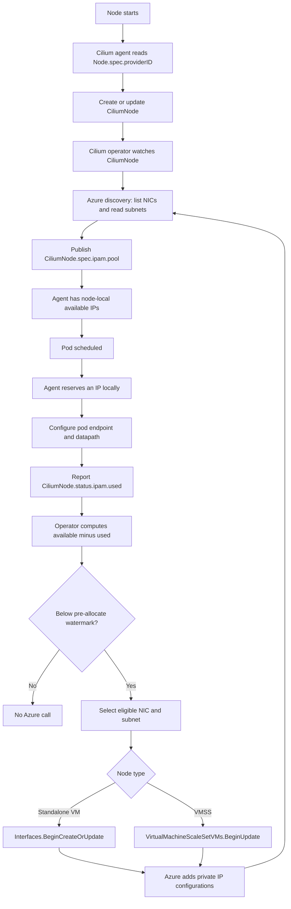

# Dynamic IP allocation with Cilium POC

## Executive summary

Cilium Azure IPAM is dynamic and elastic. The Cilium agent allocates pod IPs from a node-local pool. The single Cilium operator watches aggregate usage and keeps a configured number of free addresses available by adding or releasing Azure secondary private IP configurations asynchronously.

Pod scheduling does **not** directly call Azure. Pods consume buffered addresses first; Azure API calls occur when the node approaches its watermark or has excess capacity to release.

## API model

The control-plane contract is the cluster-scoped `CiliumNode` custom resource (`ciliumnodes.cilium.io`).

| API field | Meaning |
|---|---|
| `spec.instance-id` | Azure VM or VMSS instance identifier, derived from Kubernetes `Node.spec.providerID`. |
| `spec.azure.interface-name` | NIC selected for Cilium IP allocation. |
| `spec.ipam.pool` | Available addresses assigned to the node. The documentation calls this `spec.ipam.available`; current `main` exposes JSON field `pool`. |
| `status.ipam.used` | Subset of the pool currently allocated to pods. |
| `status.azure.interfaces` | Observed Azure NICs, subnets, and IP configurations. |

## Representative CiliumNode YAML

```yaml
apiVersion: cilium.io/v2
kind: CiliumNode
metadata:
  name: <node-name>
spec:
  instance-id: azure:///subscriptions/<sub>/resourceGroups/<rg>/providers/Microsoft.Compute/virtualMachineScaleSets/<vmss>/virtualMachines/<id>
  azure:
    interface-name: eth0
  ipam:
    pool:
      10.0.1.20:
        resource: <nic-resource-id>
    min-allocate: 0
    pre-allocate: 8
    max-allocate: 0
    max-above-watermark: 0
status:
  azure:
    interfaces: []
  ipam:
    used:
      10.0.1.20:
        owner: <pod-or-endpoint>
        resource: <nic-resource-id>
```

## End-to-end flow



## How an IP reaches a pod

1. **Node bootstrap:** the agent reads `Node.spec.providerID`, derives the Azure instance ID, and creates or updates the node's `CiliumNode`.
2. **Azure discovery:** the operator lists VM/VMSS network interfaces and reads referenced subnets.
3. **Pool publication:** successful Azure IP configurations are published in `CiliumNode.spec.ipam.pool`; observed NIC data is published in `status.azure.interfaces`.
4. **Pod allocation:** the agent reserves an unused address locally, configures the pod endpoint, and reports usage in `status.ipam.used`.
5. **Reconciliation:** the operator recalculates the deficit and adds Azure IP configurations when the free-address watermark is no longer satisfied.
6. **Resync:** the operator refreshes Azure state and republishes the resulting pool.

## Watermarks and dynamic behavior

The operator maintains a buffer so normal pod startup does not wait for Azure.

```text
free   = len(spec.ipam.pool) - len(status.ipam.used)
needed = max(preAllocate + used - available,
             minAllocate - available,
             0)
excess = (available - used) - (preAllocate + maxAboveWatermark)
```

The documentation expresses the deficit as:

```text
pre-allocate - (len(available) - len(used))
```

- `min-allocate`: bootstrap floor for the node.
- `pre-allocate`: free addresses kept immediately available; default is 8.
- `max-above-watermark`: optional headroom used to batch allocation and reduce API calls.
- `max-allocate`: hard cap, also constrained by Azure NIC and subnet limits.

The operator checks for deficits when a `CiliumNode` changes and during a periodic all-node scan, approximately once per minute. Allocation is queued and rate-limited; it is not one Azure request per pod.

When pods terminate and usage falls, excess addresses may be released if excess-IP release is enabled. The release path preserves the configured watermark.

## Go interfaces and allocation path

```go
// operator/pkg/ipam/cloud_allocator.go
type CloudAllocator interface {
    Init(ctx context.Context, logger *slog.Logger) error
    Start(ctx context.Context,
        getterUpdater allocator.CiliumNodeGetterUpdater,
        metrics nodemanager.MetricsAPI,
    ) (allocator.NodeEventHandler, error)
}

// pkg/azure/ipam/instances.go
type AzureAPI interface {
    GetSubnetsByIDs(ctx context.Context, nodeSubnetIDs []string) (ipamTypes.SubnetMap, error)
    AssignPrivateIpAddressesVM(ctx context.Context, subnetID, interfaceName string, addresses int) error
    AssignPrivateIpAddressesVMSS(ctx context.Context, instanceID, vmssName, subnetID, interfaceName string, addresses int) error
    ListAllNetworkInterfaces(ctx context.Context) ([]*armnetwork.Interface, error)
    ListVMNetworkInterfaces(ctx context.Context, instanceID string) ([]*armnetwork.Interface, error)
}

// pkg/azure/ipam/node.go
func (n *Node) AllocateIPs(ctx context.Context, a *nodemanager.AllocationAction) error {
    // Standalone VM: Interfaces.BeginCreateOrUpdate.
    // VMSS: VirtualMachineScaleSetVMs.BeginUpdate.
}
```

The Azure implementation chooses an attached interface with available address capacity and a subnet with available addresses. It then adds dynamic private IP configurations to the standalone NIC or VMSS instance network model.

## Leadership takeaway

This is a closed-loop, watermark-based system:

```text
Kubernetes scheduling and agent demand
        -> CiliumNode available/used state
        -> operator reconciliation
        -> Azure NIC/subnet capacity
        -> refreshed node-local pool
```

Pod demand changes local usage immediately; Azure capacity follows asynchronously when the buffer requires it. This improves startup latency and reduces Azure API pressure, while introducing eventual consistency between local consumption and cloud-side capacity changes.

## Source references

- [Azure IPAM documentation](https://docs.cilium.io/en/latest/network/concepts/ipam/azure/)
- [`operator/pkg/ipam/azure.go`](https://github.com/cilium/cilium/blob/main/operator/pkg/ipam/azure.go)
- [`operator/pkg/ipam/allocator/azure/azure.go`](https://github.com/cilium/cilium/blob/main/operator/pkg/ipam/allocator/azure/azure.go)
- [`operator/pkg/ipam/nodemanager/node.go`](https://github.com/cilium/cilium/blob/main/operator/pkg/ipam/nodemanager/node.go)
- [`pkg/azure/ipam/node.go`](https://github.com/cilium/cilium/blob/main/pkg/azure/ipam/node.go)
- [`pkg/azure/ipam/instances.go`](https://github.com/cilium/cilium/blob/main/pkg/azure/ipam/instances.go)
- [`pkg/azure/api/api.go`](https://github.com/cilium/cilium/blob/main/pkg/azure/api/api.go)
- [`pkg/ipam/types/types.go`](https://github.com/cilium/cilium/blob/main/pkg/ipam/types/types.go)
- [`pkg/k8s/apis/cilium.io/v2/types.go`](https://github.com/cilium/cilium/blob/main/pkg/k8s/apis/cilium.io/v2/types.go)