# Pod NSG Controller - Test Setup & Validation

## Architecture Diagram

```mermaid
graph TB
    subgraph Azure["Azure Subscription (9bd7ff15-396a-4478-a89b-4d8ae7e302b6)"]
        subgraph RG["Resource Group: asnStripe-eastus2euap"]
            subgraph ASG_BE["asg-backend"]
                PS_BE_E2["addressPrefixSet:<br/>asnstripe-eastus2euap-<br/>test-apps-backend-asg-mapping<br/><i>10.3.1.x/32 prefixes</i>"]
                PS_BE_CU["addressPrefixSet:<br/>asnstripe-centraluseuap-<br/>default-backend-asg-mapping<br/><i>10.4.1.x/32 prefixes</i>"]
            end
            subgraph ASG_FE["asg-frontend"]
                PS_FE_E2["addressPrefixSet:<br/>asnstripe-eastus2euap-<br/>test-apps-frontend-asg-mapping<br/><i>10.3.1.x/32 prefixes</i>"]
                PS_FE_CU["addressPrefixSet:<br/>asnstripe-centraluseuap-<br/>default-frontend-asg-mapping<br/><i>10.4.1.x/32 prefixes</i>"]
            end
        end
    end

    subgraph E2_Cluster["K8s Cluster: eastus2euap (asnStripe-eastus2euap)"]
        E2_CTRL["pod-nsg-controller<br/><i>ns: pod-nsg-controller-system</i>"]
        subgraph E2_NS["Namespace: test-apps"]
            E2_BE["Backend Pods (role=backend)<br/>10.3.1.x"]
            E2_FE["Frontend Pods (role=frontend)<br/>10.3.1.x"]
        end
    end

    subgraph CU_Cluster["K8s Cluster: centraluseuap (asnStripe-centraluseuap)"]
        CU_CTRL["pod-nsg-controller<br/><i>ns: pod-nsg-controller-system</i>"]
        subgraph CU_NS["Namespace: default"]
            CU_BE["Backend Pods (app=backend)<br/>10.4.1.x"]
            CU_FE["Frontend Pods (app=frontend)<br/>10.4.1.x"]
        end
    end

    %% eastus2euap controller writes
    E2_CTRL -->|"PUT If-Match: ETag<br/>api: 2025-07-01"| PS_BE_E2
    E2_CTRL -->|"PUT If-Match: ETag<br/>api: 2025-07-01"| PS_FE_E2

    %% centraluseuap controller writes (cross-region)
    CU_CTRL -->|"PUT If-Match: ETag<br/>api: 2025-07-01<br/>(cross-region)"| PS_BE_CU
    CU_CTRL -->|"PUT If-Match: ETag<br/>api: 2025-07-01<br/>(cross-region)"| PS_FE_CU

    %% Controller watches pods
    E2_CTRL -.->|watches| E2_BE
    E2_CTRL -.->|watches| E2_FE
    CU_CTRL -.->|watches| CU_BE
    CU_CTRL -.->|watches| CU_FE

    %% Styling - high contrast for visibility
    style Azure fill:#1a3a5c,stroke:#4a9eff,color:#ffffff
    style RG fill:#3d2e00,stroke:#ffb300,color:#ffffff
    style ASG_BE fill:#1b4332,stroke:#52b788,color:#ffffff
    style ASG_FE fill:#1b4332,stroke:#52b788,color:#ffffff
    style E2_Cluster fill:#4a1525,stroke:#ff6b8a,color:#ffffff
    style CU_Cluster fill:#2d1b4e,stroke:#b388ff,color:#ffffff
    style E2_NS fill:#5c2030,stroke:#ff8fa3,color:#ffffff
    style CU_NS fill:#3d2560,stroke:#ce93d8,color:#ffffff
    style PS_BE_E2 fill:#264d3b,stroke:#81c784,color:#ffffff
    style PS_BE_CU fill:#264d3b,stroke:#81c784,color:#ffffff
    style PS_FE_E2 fill:#264d3b,stroke:#81c784,color:#ffffff
    style PS_FE_CU fill:#264d3b,stroke:#81c784,color:#ffffff
    style E2_CTRL fill:#6a1b30,stroke:#ff8a80,color:#ffffff
    style CU_CTRL fill:#4a1a6b,stroke:#b388ff,color:#ffffff
    style E2_BE fill:#5c2030,stroke:#ef9a9a,color:#ffffff
    style E2_FE fill:#5c2030,stroke:#ef9a9a,color:#ffffff
    style CU_BE fill:#3d2560,stroke:#ce93d8,color:#ffffff
    style CU_FE fill:#3d2560,stroke:#ce93d8,color:#ffffff

    linkStyle 0,1 stroke:#ff6b8a,stroke-width:2px
    linkStyle 2,3 stroke:#b388ff,stroke-width:2px
    linkStyle 4,5 stroke:#ff8a80,stroke-width:1px,stroke-dasharray:5
    linkStyle 6,7 stroke:#ce93d8,stroke-width:1px,stroke-dasharray:5
```



**Reconciliation Flow:**
1. Controller watches pods matching PodASGMapping selectors
2. Computes desired IP set per ASG
3. `GET` addressPrefixSet → finds own prefix set by name in list response
4. `PUT` with `If-Match: <per-resource ETag>` to update only its own prefix set
5. Each cluster owns its own named prefix set — **no cross-cluster ETag conflicts**

## Environment

### Clusters

| Cluster | Resource Group | Region | Kubeconfig | Type |
|---------|---------------|--------|------------|------|
| asnStripe-eastus2euap | asnStripe-eastus2euap | eastus2euap | `./asnStripe-eastus2euap-kubeconfig.yaml` | Self-managed K8s |
| asnStripe-centraluseuap | asnStripe-centraluseuap | centraluseuap | `./asnStripe-centraluseuap-kubeconfig.yaml` | Self-managed K8s |

### Controller Image

- **Registry:** `acndev.azurecr.io`
- **Image:** `acndev.azurecr.io/pod-nsg-controller:26-05-20`
- **Namespace:** `pod-nsg-controller-system`
- **Node Selector:** `node-role.kubernetes.io/control-plane: ""`

### Application Security Groups (ASGs)

| ASG | Resource ID |
|-----|-------------|
| asg-backend | `/subscriptions/9bd7ff15-396a-4478-a89b-4d8ae7e302b6/resourceGroups/asnStripe-eastus2euap/providers/Microsoft.Network/applicationSecurityGroups/asg-backend` |
| asg-frontend | `/subscriptions/9bd7ff15-396a-4478-a89b-4d8ae7e302b6/resourceGroups/asnStripe-eastus2euap/providers/Microsoft.Network/applicationSecurityGroups/asg-frontend` |

### PodASGMappings

#### eastus2euap (namespace: `test-apps`)

| Mapping | Pod Selector | ASG |
|---------|-------------|-----|
| backend-asg-mapping | `role: backend` | asg-backend |
| frontend-asg-mapping | `role: frontend` | asg-frontend |

- Pods managed via **Deployments** (`backend`, `frontend`)

#### centraluseuap (namespace: `default`)

| Mapping | Pod Selector | ASG |
|---------|-------------|-----|
| backend-asg-mapping | `app: backend` | asg-backend |
| frontend-asg-mapping | `app: frontend` | asg-frontend |

- Pods are **standalone** (created with `kubectl run`)

### Address Prefix Set Naming Convention

```
<cluster-rg-lowercase>-<namespace>-<mapping-name>
```

Examples:
- `asnstripe-eastus2euap-test-apps-backend-asg-mapping`
- `asnstripe-centraluseuap-default-frontend-asg-mapping`

---

## Baseline

- **eastus2euap:** 4 pods (2 backend + 2 frontend)
- **centraluseuap:** 0 pods

---

## Tests

### Test 1: Single Cluster Scale-Up

**Objective:** Verify the controller correctly syncs pod IPs to ASG address prefix sets when scaling up.

**Steps:**
1. Start from baseline (4 pods in eastus2euap)
2. Scale eastus2euap to 10 pods (5 backend + 5 frontend)
3. Wait for reconciliation
4. Verify controller status shows `Synced` with correct `matchedPods` count
5. Verify via REST: `GET .../asg-backend/addressPrefixSets?api-version=2025-07-01`
6. Verify via REST: `GET .../asg-frontend/addressPrefixSets?api-version=2025-07-01`
7. Confirm all 10 pod IPs appear as `/32` prefixes

**Pass Criteria:**
- Both mappings show `asgSyncState: Synced`
- Address prefix sets contain exactly the running pod IPs
- `provisioningState: Succeeded`

---

### Test 2: Multi-Cluster Concurrent Writes

**Objective:** Verify two controllers from different clusters can concurrently write to the same ASGs without ETag conflicts.

**Steps:**
1. Start from baseline (4 pods in eastus2euap, 0 in centraluseuap)
2. Scale eastus2euap to 10 pods (5 backend + 5 frontend)
3. Verify eastus2euap synced
4. Scale centraluseuap to 4 pods (2 backend + 2 frontend)
5. Wait for reconciliation on both clusters
6. Verify both controllers show `Synced`
7. Verify via REST: both ASGs now have 2 prefix sets each (one per cluster)
8. Confirm each prefix set contains the correct pod IPs for its cluster

**Pass Criteria:**
- Both controllers show `asgSyncState: Synced`
- Each ASG has 2 address prefix sets (one per cluster)
- No 412 PreconditionFailed errors in controller logs
- All pod IPs correctly reflected

---

### Test 3: Scale-Down and Cleanup

**Objective:** Verify the controller removes pod IPs from prefix sets when pods are deleted.

**Steps:**
1. Start from a scaled state (e.g., 10 pods eastus2euap + 4 centraluseuap)
2. Scale eastus2euap down to 4 pods (2 backend + 2 frontend)
3. Delete all centraluseuap pods
4. Wait for reconciliation
5. Verify controller status shows reduced `matchedPods`
6. Verify via REST: prefix sets contain only remaining pod IPs
7. Verify centraluseuap prefix sets are cleaned up (deleted)

**Pass Criteria:**
- Prefix sets reflect only running pod IPs
- Centraluseuap prefix sets removed from ASGs
- Controller shows `Synced`

---

### Test 4: Parallel Scale-Up (Stress)

**Objective:** Verify both clusters can scale up simultaneously without conflicts.

**Steps:**
1. Start from baseline
2. In parallel:
   - Scale eastus2euap to 25 pods (13 backend + 12 frontend)
   - Scale centraluseuap to 10 pods (5 backend + 5 frontend)
3. Wait for reconciliation on both clusters
4. Verify both controllers show `Synced`
5. Verify via REST: all 35 pod IPs reflected across 4 prefix sets

**Pass Criteria:**
- No 412 ETag conflicts
- All 35 pod IPs correctly synced
- Both controllers `Synced` within reconciliation timeout

---

## REST API Reference

### List Address Prefix Sets for an ASG

```
GET https://management.azure.com/subscriptions/{subscriptionId}/resourceGroups/{resourceGroup}/providers/Microsoft.Network/applicationSecurityGroups/{asgName}/addressPrefixSets?api-version=2025-07-01
```

### Get Specific Address Prefix Set

```
GET https://management.azure.com/subscriptions/{subscriptionId}/resourceGroups/{resourceGroup}/providers/Microsoft.Network/applicationSecurityGroups/{asgName}/addressPrefixSets/{prefixSetName}?api-version=2025-07-01
```

> **Known Issue:** Single-resource GET returns a list envelope `{"value":[...]}` containing all prefix sets under the ASG, not just the requested one.

---

## Verification Commands

```bash
# Controller status
kubectl --kubeconfig ./asnStripe-eastus2euap-kubeconfig.yaml get podasgmappings -n test-apps

# Pod IPs
kubectl --kubeconfig ./asnStripe-eastus2euap-kubeconfig.yaml get pods -n test-apps -o custom-columns='NAME:.metadata.name,IP:.status.podIP,ROLE:.metadata.labels.role'

# ASG prefix sets via REST
az rest --method get --url "https://management.azure.com/subscriptions/9bd7ff15-396a-4478-a89b-4d8ae7e302b6/resourceGroups/asnStripe-eastus2euap/providers/Microsoft.Network/applicationSecurityGroups/asg-backend/addressPrefixSets?api-version=2025-07-01"

# Controller logs
kubectl --kubeconfig ./asnStripe-eastus2euap-kubeconfig.yaml logs -n pod-nsg-controller-system -l app.kubernetes.io/name=pod-nsg-controller --tail=50
```

---

## Known Issues (Fixed)

### ETag Conflict with Multiple Prefix Sets (PR #28)

**Problem:** When an ASG had multiple prefix sets (from different clusters), the `Get()` method took `Value[0]` from the list response without checking the name, returning the wrong ETag and causing persistent 412 errors.

**Fix:** Name-based matching in the list response + per-resource body ETag for multi-item lists.

**Image with fix:** `acndev.azurecr.io/pod-nsg-controller:poc-20260518-multiprefix-fix` (merged to main as `26-05-20`)
