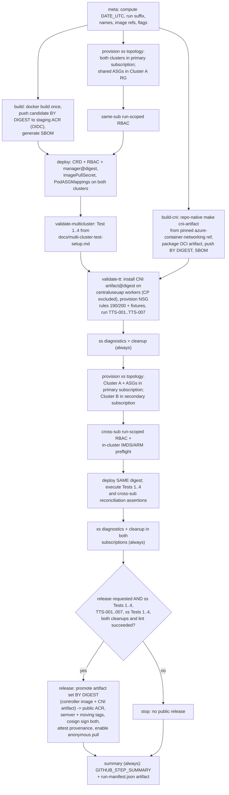
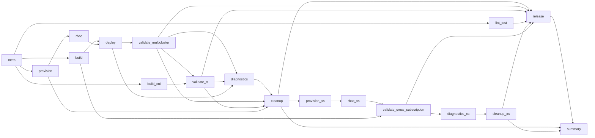
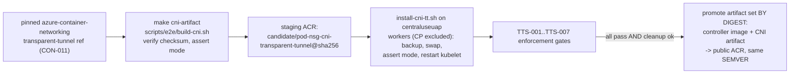

# Introduction

This PRD specifies a deterministic, autonomously executable GitHub Actions pipeline that (1) builds the Pod NSG Controller container image AND packages the transparent-tunnel CNI artifact once, (2) provisions and executes the multi-cluster end-to-end (E2E) validation defined in `docs/multi-cluster-test-setup.md` in both same-subscription and cross-subscription topologies, (3) executes the transparent-tunnel same-node NSG/ASG enforcement scenarios defined in `docs/transparent-tunnel-same-node-enforcement-test.md`, (4) collects controller, CNI, identity, RBAC, and network diagnostics, (5) reliably tears down every provisioned resource and role assignment in both subscriptions, and (6) — only after every validation topology, scenario, and cleanup succeeds — promotes the exact validated **artifact set** (controller image digest + CNI artifact digest) to a public Azure Container Registry (ACR) as a versioned release, without rebuilding. The pipeline replaces the ad-hoc, hard-coded POC scripts under `scripts/poc/` and the minimal E2E job in `.github/workflows/phase9-integration-e2e.yml` with a parameterized, run-isolated, supply-chain-hardened workflow.

The key words "MUST", "MUST NOT", "REQUIRED", "SHALL", "SHALL NOT", "SHOULD", "SHOULD NOT", "RECOMMENDED", "MAY", and "OPTIONAL" in this document are to be interpreted as described in RFC 2119.

**Cross-reference conventions**: This document uses standardized prefixes for traceability — `FR-` (functional requirements), `NFR-` (non-functional requirements), `REQ-`/`SEC-`/`CON-`/`GUD-`/`PAT-` (requirements, security, constraints, guidelines, patterns), `FM-` (failure modes), `AC-` (acceptance criteria), and `RD-` (resolved decisions). No `.req.md` exists for this initiative; all requirements are defined inline here.

## 1. Goals and Non-Goals

- **Goal 1 — Build once, promote the artifact set by digest**: Produce exactly one controller image and one transparent-tunnel CNI artifact per pipeline run and carry both immutable `sha256` digests end-to-end from build → validation → public release, with no rebuild between validation and release.
- **Goal 2 — Faithful multi-cluster validation**: Provision the two-region, two-cluster topology and execute all four tests exactly as defined in `docs/multi-cluster-test-setup.md`, including cross-region concurrent writes to shared Application Security Groups (ASGs).
- **Goal 2b — Faithful same-node enforcement validation**: Install the transparent-tunnel CNI on the centraluseuap worker nodes and execute every scenario in `docs/transparent-tunnel-same-node-enforcement-test.md` (TTS-001..TTS-007) as explicit, per-scenario validation gates that prove same-node VFP/ASG enforcement.
- **Goal 2c — Mandatory cross-subscription validation**: Re-run the documented two-cluster membership and concurrency contract with the primary cluster and shared ASGs in a primary subscription and the secondary cluster in a distinct secondary subscription, proving IMDS authentication, least-privilege cross-subscription RBAC, ARM access, reconciliation, scale-down, and cleanup before release.
- **Goal 3 — Deterministic, collision-free naming**: Generalize every Azure and Kubernetes resource name so it deterministically encodes purpose, UTC date, and unique run identity while satisfying each provider's length/charset/global-uniqueness constraints.
- **Goal 4 — Reliable, always-on cleanup**: Guarantee teardown of all provisioned resources on success, failure, or cancellation, with verification, and a scheduled reaper as a backstop.
- **Goal 5 — Gated, hardened public release**: Publish a semantically versioned, immutable, signed artifact set (controller image + CNI artifact) with SBOM and provenance to a public ACR, only after every validation scenario AND cleanup succeed.
- **Goal 6 — Zero long-lived cloud secrets**: Authenticate to Azure exclusively via GitHub OIDC workload identity federation with least-privilege RBAC.
- **Non-Goal 1 — Controller feature changes**: This plan MUST NOT modify controller reconciliation logic, the `PodASGMapping` API (`api/v1alpha1`), or the ARM client under `internal/azure`.
- **Non-Goal 1b — Authoring CNI source**: This plan MUST NOT author or fork the CNI data-plane source; the transparent-tunnel `azure-vnet` binary and conflist originate from the external `azure-container-networking` transparent-tunnel build (CON-011). This plan pins, builds/packages, validates, and releases that artifact but does not own its source code.
- **Non-Goal 2 — Production/GA distribution channel**: Onboarding the image to `mcr.microsoft.com` (Microsoft Artifact Registry) or any GA distribution governance is out of scope; the "public ACR" target is an ACR with anonymous pull enabled.
- **Non-Goal 3 — Managed AKS**: The documented topology is self-managed Kubernetes on Azure VMs (`scripts/poc/setup-cluster-*.sh`); migrating to AKS is out of scope.
- **Non-Goal 4 — Arbitrary-region matrix**: The validated ASG `addressPrefixSets` API (`2025-07-01`) is available only in EUAP/canary regions; generalized region selection beyond the documented canary regions is out of scope (see CON-001).

### In Scope

- A primary reusable workflow `.github/workflows/e2e-validation-release.yml` implementing build, provision, deploy, validate, diagnostics, cleanup, and gated release.
- A scheduled reaper workflow `.github/workflows/e2e-reaper.yml` that deletes orphaned run-tagged resources past their TTL.
- Parameterized provisioning/validation/teardown/promotion scripts under a new `scripts/e2e/` directory that generalize `scripts/poc/`.
- A deterministic naming library and algorithm (`scripts/e2e/naming.sh`) and its formal specification (Section 3.4).
- Same-subscription (`ss`) and cross-subscription (`xs`) run-isolated topologies. Release-triggered and scheduled full validations MUST execute both; manual non-release runs MAY select one topology for diagnostics, but a release MUST NOT waive either topology.
- Cross-subscription OIDC bootstrap, per-subscription provisioning, VM managed-identity grants scoped to run resource groups, in-cluster IMDS/ARM preflight checks, controller reconciliation against shared ASGs in the primary subscription, and verified cleanup/reaping in both subscriptions.
- Repository-native build/packaging of the transparent-tunnel CNI artifact (new `Makefile` targets + `scripts/e2e/build-cni.sh`) into a digest-addressable OCI artifact, its install onto worker nodes, and the TTS-001..TTS-007 enforcement validation (`scripts/e2e/run-tt-validation.sh`).
- Supply-chain controls: candidate-by-digest publish, SBOM, keyless signing, and SLSA provenance attestation for the released digest.
- Supply-chain controls applied to BOTH the controller image and the CNI artifact (candidate-by-digest publish, SBOM, keyless signing, SLSA provenance) so the released artifact set is fully attested.
- One-time bootstrap documentation for OIDC federation, staging registry, public ACR, and GitHub Environments/approvals.

### Out of Scope (deferred)

- **Continuous nightly trend dashboards / metrics warehousing** — deferred; the pipeline emits per-run artifacts and step summaries only, which satisfy current auditability needs.
- **Legacy three-cluster mesh shape** from `scripts/poc/validate-poc.sh` — deferred. Cross-subscription behavior is in scope through the minimal two-cluster variant that preserves the authoritative regions, workloads, and Tests 1–4 while placing Cluster B in the secondary subscription.
- **Windows/multi-arch controller images** — deferred; the controller `Dockerfile` targets `linux/amd64` only.

## 2. Terminology

| Term | Definition |
|------|------------|
| Candidate image | The single image built in a run, referenced immutably by its `sha256` digest, published to the staging registry, and subject to validation before any release. |
| Artifact set | The atomic unit that is validated and released together: the controller image (`@sha256:…`) plus the transparent-tunnel CNI OCI artifact (`@sha256:…`) and its `azure-linux-transparent-tunnel.conflist`. Both digests are promoted together, without rebuild. |
| CNI artifact | A digest-addressable OCI artifact packaging the transparent-tunnel `azure-vnet` binary (linux/amd64) and `azure-linux-transparent-tunnel.conflist` (`"mode": "transparent-tunnel"`), built/packaged from a pinned `azure-container-networking` transparent-tunnel source ref via repository-native commands. |
| transparent-tunnel | An Azure CNI mode layered on top of `transparent` that steers same-node pod-to-pod traffic out the host primary NIC (policy routing via fwmark → `ip rule` → dedicated route table → hairpin) so the host VFP evaluates NSG/ASG rules. No encapsulation/encryption. Per `docs/transparent-tunnel-same-node-enforcement-test.md`. |
| VFP | Azure host Virtual Filtering Platform; the data-plane component that evaluates NSG/ASG rules on packets that traverse the host primary NIC. Same-node traffic only reaches VFP under transparent-tunnel. |
| Release image | The exact candidate digest promoted (server-side copied) into the public ACR under a semantic-version tag. Byte-identical manifest and digest to the candidate. |
| Staging registry | A private ACR repository (`candidate/pod-nsg-controller`) holding unvalidated candidate images; never publicly readable. |
| Public ACR | An ACR with anonymous pull enabled that hosts released images at repository `pod-nsg-controller`. |
| Run identity | The tuple `(github.run_id, github.run_attempt)` uniquely identifying one workflow execution attempt. |
| Run suffix | A 6-character deterministic base36 token derived from run identity (Section 3.4), used to guarantee name uniqueness including for globally unique resources. |
| Validation topology | `same-subscription` (`ss`) or `cross-subscription` (`xs`). The topology code is part of every run resource base name so both variants can coexist without collisions. |
| Primary subscription | The Azure subscription containing Cluster A, the shared ASGs, and the primary run resource group in both topologies. |
| Secondary subscription | A distinct Azure subscription containing Cluster B only in the `xs` topology. Its VM identities receive run-scoped access to shared ASGs in the primary subscription. |
| DATE_UTC | The `YYYYMMDD` UTC date captured once at run start and propagated to all jobs, so names are stable across midnight boundaries. |
| Shared ASGs | `asg-backend` and `asg-frontend`, provisioned once per run in the primary region resource group, written to concurrently by both clusters' controllers. |
| Address prefix set | An ASG child resource (`Microsoft.Network/applicationSecurityGroups/addressPrefixSets`, API `2025-07-01`) owned per cluster; its name is controller-computed as `<cluster-rg-lowercase>-<namespace>-<mapping-name>`. |
| EUAP / canary region | Early-Update-Access-Program regions (`eastus2euap`, `centraluseuap`) where the `addressPrefixSets` API is available. |
| OIDC / WIF | GitHub OpenID Connect federated to an Azure workload identity (federated credential on a user-assigned managed identity or app registration), yielding short-lived tokens with no stored secret. |
| Promotion | Server-side copy of a manifest/artifact by digest from staging ACR to public ACR via `az acr import` (images) or `oras copy` (OCI artifacts), preserving the digest without a rebuild. |
| TTS scenario | One discrete transparent-tunnel enforcement scenario (TTS-001..TTS-007) derived from `docs/transparent-tunnel-same-node-enforcement-test.md` §4.1–§4.5/§5, each with its own requirement, test, and acceptance criterion. |

## 3. Solution Architecture

### 3.1 Overview

The pipeline is a single GitHub Actions workflow composed of dependent jobs. A `meta` job computes deterministic run metadata and names for both `ss` and `xs`; `build` produces one candidate controller image and publishes it by digest; `build_cni` builds/packages the transparent-tunnel CNI OCI artifact once and publishes it by digest. The workflow first provisions, deploys, and executes Tests 1–4 on the `ss` topology, then runs transparent-tunnel scenarios TTS-001..TTS-007 on that topology. After its diagnostics and cleanup complete, the workflow provisions the `xs` topology across primary and secondary subscriptions, establishes run-scoped cross-subscription RBAC, deploys the same controller digest, and re-executes Tests 1–4 plus explicit cross-subscription identity/access assertions. Sequential topology execution is the default to bound EUAP quota. Per-topology diagnostics and cleanup always run. `release` promotes the validated artifact set only when both topology validations, transparent-tunnel validation, and both cleanups succeed.

### 3.2 End-to-end lifecycle (build/validate vs release)

### 3.3 Job dependency graph and gates

- Both topology-specific `diagnostics_*` and `cleanup_*` jobs and `summary` MUST use `if: always()`.
- Neither topology cleanup MUST be skipped when upstream jobs fail or the run is cancelled; `cleanup_xs` MUST authenticate to and verify deletion in both subscriptions.
- `release` MUST require `validate_multicluster`, `validate_tt`, `cleanup`, `validate_cross_subscription`, `cleanup_xs`, and `lint_test` to report `success`, and MUST additionally require either a published `v*` release/tag event or `workflow_dispatch` with `release=true` and a valid `release_version`.
- `validate_tt` MUST run AFTER `validate_multicluster` on the shared centraluseuap cluster, because installing transparent-tunnel mutates that cluster's data plane; the multi-cluster membership tests MUST complete on stock CNI first (RD-017).

### 3.4 Deterministic generalized naming algorithm (normative)

All resource names MUST be produced by the algorithm below (reference implementation: `scripts/e2e/naming.sh`). The algorithm is a pure function of GitHub Actions context, so it is reproducible and auditable.

#### 3.4.1 Inputs (deterministic)

| Variable | Source | Example |
|----------|--------|---------|
| `PURPOSE` | Fixed constant | `pnc-e2e` |
| `DATE_UTC` | `date -u +%Y%m%d`, captured once in `meta`, exported to all jobs | `20260820` |
| `RUN_ID` | `${{ github.run_id }}` | `10293847561` |
| `RUN_ATTEMPT` | `${{ github.run_attempt }}` | `1` |
| `REPO` | `${{ github.repository }}` | `Azure/pod-nsg-controller` |
| `GIT_SHA` | `${{ github.sha }}` (first 12 used in tags/labels) | `8504b2e1c3a9` |
| `REGION` | Matrix region from typed input (default `eastus2euap`, `centraluseuap`) | `centraluseuap` |
| `TOPOLOGY` | Fixed workflow value: `same-subscription` or `cross-subscription` | `cross-subscription` |
| `TOPOLOGY_CODE` | Derived fixed token: `ss` or `xs` | `xs` |
| `SUBSCRIPTION_ROLE` | Derived from topology/region: `primary` or `secondary`; raw subscription IDs are manifest metadata, not name inputs | `secondary` |

#### 3.4.2 Primitive functions

- `RUN_SUFFIX` = lowercase base36 of `int(hex(sha256("{REPO}:{RUN_ID}:{RUN_ATTEMPT}"))[0:8]) mod 36^6`, left-padded to 6 chars. Deterministic; range `36^6 ≈ 2.18e9`; charset `[0-9a-z]`. Provides uniqueness for globally unique resources.
- `normalize(s)`: lowercase; replace each char not in `[a-z0-9-]` with `-`; collapse repeated `-`; strip leading/trailing `-`.
- `alnum(s)`: lowercase; delete every char not in `[a-z0-9]` (for storage/ACR-style names).
- `fit(name, maxLen)`: if `len(name) <= maxLen` return `name`; else return `name[0:maxLen-5] + "-" + hex(sha256(name))[0:4]` (deterministic truncation that preserves uniqueness).
- The library MUST validate every emitted name against Section 3.4.5 limits and fail fast (exit non-zero) on any violation (see CON-006).

#### 3.4.3 Base tokens

- `BASE` = `PURPOSE + "-" + TOPOLOGY_CODE + "-" + DATE_UTC + "-" + RUN_SUFFIX` → e.g. `pnc-e2e-xs-20260820-k3f9q2` (26 chars).
- `RBASE(region)` = `fit(BASE + "-" + normalize(region), 44)` → e.g. `pnc-e2e-xs-20260820-k3f9q2-eastus2euap` (38 chars). The 44-char cap guarantees the derived address-prefix-set invariant (Section 3.4.4).

#### 3.4.4 Address-prefix-set length invariant (normative)

The controller computes each prefix set name as `normalize(<cluster-rg>) + "-" + <namespace> + "-" + <mapping>`. Because ASG child-resource names MUST be `<= 80` chars (CON-005), the naming function MUST enforce:

`len(RGname) + 1 + len(namespace) + 1 + len(mapping) <= 80`

With `namespace ∈ {test-apps(9), default(7)}` and `mapping ∈ {backend-asg-mapping(19), frontend-asg-mapping(20)}`, the worst case requires `len(RGname) <= 49`; the `RBASE` cap of 44 satisfies it with margin. Worked example (secondary cluster, worst case): `pnc-e2e-xs-20260820-k3f9q2-centraluseuap`(40) + `-default`(8) + `-frontend-asg-mapping`(21) = **69 <= 80**.

#### 3.4.5 Resource name mapping (normative)

| Resource (provider) | Pattern | Example | Limit / charset | Uniqueness scope |
|---------------------|---------|---------|-----------------|------------------|
| Resource Group (per region) | `RBASE(region)` | `pnc-e2e-xs-20260820-k3f9q2-eastus2euap` | 1–90; `[A-Za-z0-9_().-]`, no trailing `.` | Subscription |
| Virtual Network | `${RBASE}-vnet` | `pnc-e2e-xs-20260820-k3f9q2-centraluseuap-vnet` | 2–64 | Resource group |
| Subnet | `${RBASE}-subnet` | `...-k3f9q2-eastus2euap-subnet` | 1–80 | VNet |
| Network Security Group | `${RBASE}-nsg` | `...-k3f9q2-eastus2euap-nsg` | 1–80 | Resource group |
| NAT Gateway / PIPs | `${RBASE}-natgw`, `${RBASE}-natgw-pip`, `${RBASE}-cp-pip` | `...-k3f9q2-eastus2euap-natgw` | 1–80 | Resource group |
| Control-plane VM | `fit(${RBASE}-cp-01, 64)` | `...-k3f9q2-eastus2euap-cp-01` | 1–64 (Linux); also becomes node name (RFC1123 label `<=63`) | Resource group |
| Worker VMs | `fit(${RBASE}-worker-0N, 64)` | `...-k3f9q2-eastus2euap-worker-01` | 1–64; node name `<=63` | Resource group |
| NIC | `${vmName}-nic` | `...-worker-01-nic` | 1–80 | Resource group |
| NIC IP configs | `ipconfig-pod-N` (N=1..9, unchanged) | `ipconfig-pod-3` | 1–80 | NIC |
| Shared ASGs | `asg-backend`, `asg-frontend` (in primary RG; RG-isolated + tagged) | `asg-backend` | 1–80 | Primary resource group |
| Address prefix set (controller-computed) | `normalize(clusterRG)-<ns>-<mapping>` | `pnc-e2e-xs-20260820-k3f9q2-eastus2euap-test-apps-backend-asg-mapping` | `<=80` (see 3.4.4) | ASG |
| NSG enforcement rules (transparent-tunnel) | fixed `DenyBackendToFrontend` (prio 190), `AllowFrontendToBackend` (prio 200) on the centraluseuap subnet NSG `${RBASE}-nsg` | `DenyBackendToFrontend` | rule name `<=80`; priority 100–4096 | Network security group |
| K8s namespace (workload) | `test-apps` (cluster A), `default` (cluster B) — documented; run-tagged via labels | `test-apps` | RFC1123 label `<=63` | Cluster (ephemeral) |
| K8s namespace (controller) | `pod-nsg-controller-system` (unchanged) | `pod-nsg-controller-system` | RFC1123 label `<=63` | Cluster (ephemeral) |
| PodASGMapping CRs | `backend-asg-mapping`, `frontend-asg-mapping` (documented) | `backend-asg-mapping` | RFC1123 subdomain `<=253` | Namespace |
| Workloads | Deployments `backend`,`frontend` (cluster A); standalone pods `backend`,`frontend` (cluster B) | `backend` | RFC1123 | Namespace |
| Transparent-tunnel pods (centraluseuap, ns `default`) | fixed `backend-tt`, `frontend-tt`, `tt-canary`, same-node pinned via `nodeName` | `backend-tt` | RFC1123 label `<=63` | Namespace |
| Staging repo/tag (candidate) | repo `candidate/pod-nsg-controller`, ref by `@sha256:…`; run tag MUST be topology-neutral because one candidate serves both variants | `candidate/pod-nsg-controller:run-20260820-k3f9q2` | repo 2–256 `[a-z0-9._/-]`; tag `<=128` `[A-Za-z0-9_][A-Za-z0-9_.-]*` | Staging ACR |
| CNI staging artifact repo/tag (candidate) | repo `candidate/pod-nsg-cni-transparent-tunnel`, ref by `@sha256:…`; same topology-neutral run tag | `candidate/pod-nsg-cni-transparent-tunnel:run-20260820-k3f9q2` | repo 2–256 `[a-z0-9._/-]`; tag `<=128` | Staging ACR |
| Public release repo/tags | repo `pod-nsg-controller`, tags `${SEMVER}` + optional moving `latest`,`vMAJOR`,`vMAJOR.MINOR` | `pod-nsg-controller:v0.1.0` | as above | Public ACR |
| CNI public release repo/tags | repo `pod-nsg-cni-transparent-tunnel`, SAME `${SEMVER}` as the controller (artifact set shares one version) + optional moving tags | `pod-nsg-cni-transparent-tunnel:v0.1.0` | as above | Public ACR |
| Diagnostics storage account (optional, per topology) | `alnum(PURPOSE+TOPOLOGY_CODE+DATE_UTC+RUN_SUFFIX)[0:24]` | `pnce2exs20260820k3f9q2` | 3–24 lowercase alnum, global | Global |
| Role assignments (cross-region/cross-subscription) | GUID (system-generated), recorded in manifest, scoped to the topology's primary run RG | `(guid)` | GUID | Assignment scope |

#### 3.4.6 Correlation labels/tags (normative)

Every Azure resource group (tags inherited/applied to child resources where supported) MUST carry, and every provisioned Kubernetes namespace/workload/mapping MUST be labeled with, the following keys (Azure tag keys shown; K8s labels use the `validation.networking.azure.com/` prefix with the same suffixes):

`validation-purpose=pnc-e2e`, `validation-run-id=<RUN_ID>`, `validation-run-attempt=<RUN_ATTEMPT>`, `validation-date-utc=<DATE_UTC>`, `validation-run-suffix=<RUN_SUFFIX>`, `validation-topology=<ss|xs>`, `validation-subscription-role=<primary|secondary>`, `git-sha=<GIT_SHA>`, `git-ref=<github.ref>`, `managed-by=github-actions`, `ttl-hours=<TTL>` (default `6`). These enable audit correlation and reaper-based cleanup across both subscriptions even when a name is truncated by `fit`.

### 3.5 Candidate distribution to self-managed clusters

Self-managed kubelets have no native ACR credential integration. The pipeline MUST make the candidate pullable by: (a) authenticating to the staging ACR via OIDC in `deploy`; (b) minting a short-lived, repository-scoped ACR token at deploy time; (c) writing it as a Kubernetes `imagePullSecret` in `pod-nsg-controller-system`; and (d) deleting that secret during cleanup. No long-lived registry credential is stored in GitHub. See RD-004 and SEC-004.

### 3.6 Transparent-tunnel CNI artifact: build, packaging, availability, and artifact-set release

The transparent-tunnel CNI is a **separate data-plane artifact** from the controller image and follows the same build-once/validate/promote-by-digest discipline. Grounding: this repository contains **no CNI source**; the existing convention (`scripts/poc/setup-cluster-eastus2euap.sh` lines 216–255) fetches a pinned released `azure-vnet` binary and writes a `/etc/cni/net.d/10-azure.conflist`, then restarts kubelet. `docs/transparent-tunnel-same-node-enforcement-test.md` §4.1 sources the transparent-tunnel `azure-vnet` binary and `azure-linux-transparent-tunnel.conflist` from the external `azure-container-networking` transparent-tunnel build and installs them per worker via `az vm run-command`.

- **Build/package (repository-native, build once)**: `build-cni` MUST invoke repository-native commands — new `Makefile` targets `cni-build`, `cni-package`, `cni-artifact` wrapping `scripts/e2e/build-cni.sh` — that acquire the transparent-tunnel `azure-vnet` (linux/amd64) and `azure-linux-transparent-tunnel.conflist` from a **pinned** `azure-container-networking` source ref (RD-015/CON-011), verify a recorded checksum, and package them as a single **digest-addressable OCI artifact** pushed by digest to the staging ACR (`candidate/pod-nsg-cni-transparent-tunnel`). An SBOM MUST be generated for the artifact. The conflist MUST contain `"mode": "transparent-tunnel"` (asserted at build time).
- **Make available to the E2E environment**: `validate-tt` MUST pull the CNI artifact by digest from staging (OIDC) onto the runner, then distribute the exact bytes to each centraluseuap **worker** node via `az vm run-command invoke` (the only node-access path; §2 of the test doc), installing per `scripts/e2e/install-cni-tt.sh` — a generalization of the doc's `tt_install.sh` that backs up the existing CNI to `/opt/cni/tt-backup-<ts>`, installs the binary, swaps the conflist, asserts `"mode": "transparent-tunnel"`, and restarts kubelet. The **control-plane node MUST remain on stock CNI** (it hosts the controller and is intentionally excluded). No CNI hosting URL with an embedded credential/SAS token is committed (SEC-006, mirroring the doc's explicit warning).
- **Same-node enforcement topology**: on one centraluseuap worker, `backend-tt` (label `app=backend`) and `frontend-tt` (label `app=frontend`) are pinned to the same `nodeName` in namespace `default`; the controller populates `asg-backend`/`asg-frontend` prefix sets; the subnet NSG carries rule 190 `DenyBackendToFrontend` (backend→frontend, Any) and rule 200 `AllowFrontendToBackend` (frontend→backend, TCP 8080). Transparent-tunnel forces the same-node flow through the host NIC so VFP evaluates these rules (Section 4.4 tests).
- **Artifact-set release without rebuild**: the release job promotes **both** validated digests together — the controller image (`az acr import`) and the CNI OCI artifact (`oras copy`/`az acr import`) — to the public ACR under the **same** `${SEMVER}` tag, with no rebuild (FR-024, RD-013/RD-014). The `run-manifest.json` records both digests and proves the promoted set equals the validated set (NFR-006/NFR-011).

## 4. Requirements

**Summary**: The pipeline MUST build one controller image and one transparent-tunnel CNI artifact, validate them against same-subscription and cross-subscription variants of the documented multi-cluster topology AND the same-node transparent-tunnel enforcement scenarios, always clean up both subscriptions, and gate a digest-preserving public release on every validation topology, scenario, and cleanup succeeding.

### 4.1 Functional Requirements

**Items**:
- **FR-001**: The pipeline MUST build the controller image exactly once per run from `Dockerfile` (multi-stage, `gcr.io/distroless/static:nonroot`, `linux/amd64`), reusing the `make docker-build` contract where practical.
- **FR-002**: The pipeline MUST push the candidate controller image AND the candidate CNI artifact to the staging ACR and capture BOTH immutable `sha256` digests; all downstream jobs MUST reference each by `@sha256:<digest>` (never by mutable tag).
- **FR-003**: The pipeline MUST provision two isolated variants of the documented two-region self-managed topology: `ss` with both clusters in the primary subscription, and `xs` with Cluster A/shared ASGs in the primary subscription and Cluster B in a distinct secondary subscription.
- **FR-004**: The pipeline MUST deploy the candidate controller to both clusters using `config/crd/`, `config/rbac/rbac.yaml`, and `config/manager/manager.yaml` with the image overridden to the candidate digest and a runtime `imagePullSecret`.
- **FR-005**: The pipeline MUST execute Tests 1–4 from `docs/multi-cluster-test-setup.md` and assert every documented Pass Criterion in BOTH `ss` and `xs`; test results MUST be independently reported by topology.
- **FR-006**: The pipeline MUST collect diagnostics on every run — controller logs, `PodASGMapping` status, pod IPs, ASG `addressPrefixSets` via `az rest`, node status, AND transparent-tunnel CNI/network diagnostics per FR-023 — and upload them as run-retained artifacts, regardless of validation outcome.
- **FR-007**: The pipeline MUST tear down all `ss` and `xs` resources, including resource groups in both subscriptions, cross-region/cross-subscription role assignments, staging candidate tags, NSG enforcement rules, transparent-tunnel pods, and cluster `imagePullSecret`s on success, failure, and cancellation, and MUST verify deletion in each owning subscription.
- **FR-008**: The pipeline MUST gate release on successful same-subscription Tests 1–4, TTS-001..TTS-007, same-subscription cleanup, cross-subscription Tests 1–4 plus cross-subscription preflights, cross-subscription cleanup in both subscriptions, and lint/test. Any failure blocks release.
- **FR-009**: The release job MUST promote the exact validated **artifact set** — the controller image digest (`az acr import`) AND the CNI artifact digest (`oras copy`/`az acr import`) — to the public ACR with no rebuild, applying the SAME semantic-version tag to both repositories and, when requested, moving tags (`latest`, `vMAJOR`, `vMAJOR.MINOR`).
- **FR-010**: The public ACR release repository MUST be anonymously pullable so external consumers can `docker pull` without credentials.
- **FR-011**: All Azure/Kubernetes resource names MUST be produced by Section 3.4, encoding purpose + topology code + UTC date + run identity and honoring provider constraints.
- **FR-012**: The workflow MUST expose typed `workflow_dispatch` inputs (`regions`, `validation_topologies`, `run_full_validation`, `release`, `release_version`, `moving_tags`, `keep_resources_on_failure`, `primary_subscription_id`, `secondary_subscription_id`) and implement Section 9.1. A release request MUST force `validation_topologies=ss,xs`.
- **FR-013**: Cloud-touching and release jobs MUST run under GitHub Environments with required reviewers/approvals (`azure-e2e`, `public-release`).
- **FR-014**: The workflow MUST define a concurrency policy that serializes cloud E2E/release runs (`cancel-in-progress: false`) and separately cancels superseded PR fast-checks (`cancel-in-progress: true`).
- **FR-015**: The workflow MUST emit a summary and manifest recording generated names/subscription roles, both artifact digests, Tests 1–4 results for `ss` and `xs`, XSUB-001..003, TTS-001..007, and cleanup verification per subscription without exposing credentials or tokens.
- **FR-016**: The release job MUST attach an SBOM, sign the released digest with keyless cosign (OIDC), and produce SLSA build-provenance attestation for the released digest.
- **FR-017**: A scheduled reaper workflow MUST authenticate independently to both configured subscriptions and delete expired run-tagged resource groups and dangling run-scoped role assignments in each.
- **FR-018**: The pipeline MUST build/package the transparent-tunnel CNI artifact (transparent-tunnel `azure-vnet` linux/amd64 binary + `azure-linux-transparent-tunnel.conflist`) exactly once per run via repository-native commands (new `Makefile` targets `cni-build`/`cni-package`/`cni-artifact` wrapping `scripts/e2e/build-cni.sh`) from a pinned `azure-container-networking` source ref, verifying a recorded checksum and asserting the conflist declares `"mode": "transparent-tunnel"`.
- **FR-019**: The pipeline MUST publish the CNI artifact by digest to the staging ACR, generate an SBOM for it, and make the exact validated bytes available to the E2E environment by distributing them to each centraluseuap worker node via `az vm run-command invoke` (checksum-verified), never via an unpinned or credential-embedding URL.
- **FR-020**: The pipeline MUST install the candidate CNI on every centraluseuap **worker** node per `scripts/e2e/install-cni-tt.sh` (generalizing the doc's `tt_install.sh`): back up existing CNI to `/opt/cni/tt-backup-<ts>`, install the binary, swap the conflist, assert `"mode": "transparent-tunnel"`, restart kubelet; the **control-plane node MUST remain on stock CNI** (TTS-001).
- **FR-021**: The pipeline MUST provision the transparent-tunnel enforcement fixtures on the centraluseuap cluster: NSG rule 190 `DenyBackendToFrontend` (Deny; source ASG `asg-backend` → dest ASG `asg-frontend`; Any) and rule 200 `AllowFrontendToBackend` (Allow; ASG `asg-frontend` → ASG `asg-backend`; TCP 8080) on the workload subnet's NSG, plus the `app=backend`/`app=frontend` PodASGMappings in namespace `default`, exactly as in `docs/transparent-tunnel-same-node-enforcement-test.md` §3.
- **FR-022**: The pipeline MUST execute every documented transparent-tunnel same-node enforcement scenario TTS-001..TTS-007 (§4.1–§4.5/§5) as explicit, independently-reported validation gates, asserting each scenario's documented pass criteria; `validate_tt` MUST fail if any scenario fails.
- **FR-023**: The pipeline MUST collect transparent-tunnel diagnostics on every run: per-worker conflist `mode` and `kubelet` status, backup-dir presence, `ip rule`/policy route tables and fwmark config, pod→host `azv*` veth mapping (`ip route get`), the `eth0` packet capture (`/tmp/tt-eth0.pcap`) from §4.5, ASG `addressPrefixSets` membership, and controller logs — uploaded as artifacts.
- **FR-024**: The pipeline MUST ensure the released artifact set (controller image + CNI artifact) is byte-identical (by digest) to the set validated in the same run, promoted without rebuild; the pipeline MUST NOT release either artifact independently or from a different run.
- **FR-025**: The `xs` topology MUST use two distinct validated subscription IDs: Cluster A/shared ASGs in the primary subscription and Cluster B in the secondary subscription. The workflow MUST fail before provisioning if the IDs are equal, unavailable, or lack required EUAP quota/provider registration.
- **FR-026**: The pipeline MUST create only run-RG-scoped `Network Contributor` assignments needed for Cluster B VM identities to access the primary ASG resource group, wait for propagation with bounded retries, record assignment IDs, and remove/verify them during cleanup.
- **FR-027**: Before controller validation, a pod in each `xs` cluster MUST acquire an ARM token through IMDS. Cluster A MUST GET its local primary run RG; Cluster B MUST cross the subscription boundary to GET the primary run RG and both shared ASGs. A skipped token or ARM check is a failure, not a warning.
- **FR-028**: The `xs` controller deployment MUST set `AZURE_SUBSCRIPTION_ID` and `AZURE_RESOURCE_GROUP` to the primary ASG target for both clusters, then prove Cluster B pod IPs are created, updated, and deleted in Cluster B-owned address prefix sets under the primary-subscription ASGs during Tests 1–4.

### 4.2 Non-Functional Requirements

**Items**:
- **NFR-001 (Idempotency/isolation)**: Concurrent/repeated runs and `ss`/`xs` topologies MUST NOT collide; topology-coded bases, `RUN_SUFFIX`, and per-run RGs isolate all state.
- **NFR-002 (Least privilege)**: Per-subscription federated identities MUST be limited to run-RG lifecycle and required role-assignment operations; runtime VM identities MUST receive only RG-scoped `Network Contributor`; no identity may hold Owner.
- **NFR-003 (Bounded execution)**: Every job MUST declare `timeout-minutes`; flaky Azure operations (VM `run-command`, RBAC propagation, reconciliation waits) MUST use bounded retries with backoff.
- **NFR-004 (Cost control)**: Runs MUST be serialized in the cloud concurrency group, use the smallest viable VM SKU consistent with the POC (`Standard_D4s_v5`), set resource TTL tags, and rely on always-on teardown plus the reaper to prevent cost leaks.
- **NFR-005 (No standing secrets)**: The workflow MUST NOT consume any long-lived cloud credential; Azure auth MUST be OIDC-only. Registry push/pull MUST use OIDC-derived, short-lived tokens.
- **NFR-006 (Determinism/traceability)**: The released digest MUST be byte-identical to the validated candidate digest; the `run-manifest.json` MUST prove the chain build→validate→release referenced one digest.
- **NFR-007 (Constraint compliance)**: Name generation MUST validate against provider limits at runtime and fail fast on violation.
- **NFR-008 (Retention)**: Diagnostics and manifest artifacts MUST be retained for a configurable period (default 30 days).
- **NFR-009 (Release immutability)**: A semantic-version tag in the public ACR MUST NOT be overwritten once published; re-releasing an existing version MUST fail. Moving tags MAY advance.
- **NFR-010 (CNI artifact reproducibility)**: The CNI artifact MUST be built from a pinned source ref, checksum-verified, and digest-addressable; two runs of the same source ref MUST produce a functionally equivalent, verifiable artifact, and the installed bytes MUST match the published digest.
- **NFR-011 (Artifact-set atomicity)**: The controller image and CNI artifact MUST be validated and released as one atomic set under a single `${SEMVER}`; a release MUST NOT publish one without the other, and the `run-manifest.json` MUST record both digests for the released version.
- **NFR-012 (Cross-subscription traceability)**: Every `xs` Azure request, test result, role assignment, resource, and cleanup assertion MUST be attributable to the run and subscription role without logging access tokens.

### 4.3 Requirements, Constraints, Guidelines, Patterns

**Items**:
- **REQ-001**: Validation topology, tests, and pass criteria are authoritatively defined by `docs/multi-cluster-test-setup.md` and MUST be treated as the contract for `validate_multicluster`.
- **REQ-002**: Provisioning MUST reproduce the self-managed K8s + Azure CNI setup from `docs/self-managed-k8s-azure-cni-setup.md` / `scripts/poc/setup-cluster-eastus2euap.sh` (kubeadm v1.31, Azure CNI v1.6.6, control-plane node selector/toleration).
- **REQ-003**: The controller MUST be deployed with `nodeSelector: node-role.kubernetes.io/control-plane: ""` and the control-plane toleration, matching `config/manager/manager.yaml`.
- **REQ-004**: Transparent-tunnel topology, NSG rules, fixtures, scenarios, and pass criteria are authoritatively defined by `docs/transparent-tunnel-same-node-enforcement-test.md` and MUST be treated as the contract for `validate_tt`; the scenarios run on the centraluseuap cluster (namespace `default`, `app` selectors) which already matches that document's requirements.
- **REQ-005**: Cross-subscription validation MUST generalize the proven identity/RBAC patterns in `scripts/poc/setup-cross-sub-rbac.sh`, `scripts/poc/validate-poc.sh`, `docs/cross-subscription-pod-asg-access.md`, and `docs/PERFORMANCE-BENCHMARK-REPORT.md`, while using the two-cluster canary topology and Tests 1–4 from REQ-001.
- **SEC-001**: Azure authentication MUST use GitHub OIDC (`permissions: id-token: write`) with `azure/login@v2`, extending the pattern already in `.github/workflows/phase9-integration-e2e.yml`.
- **SEC-002**: Per-subscription E2E federated identities MUST be least-privilege; controller VM grants MUST be scoped to the primary run RG. Subscription-level bootstrap permissions MUST be custom roles limited to creating/deleting tagged run RGs and assigning/removing the approved role, never Owner.
- **SEC-003**: No pre-release (candidate) image may be publicly readable; the staging ACR MUST NOT enable anonymous pull.
- **SEC-004**: Cluster image-pull credentials MUST be short-lived, minted at runtime, and deleted on cleanup (Section 3.5).
- **SEC-005**: Released images MUST be signed (cosign keyless) and carry SBOM + provenance (FR-016).
- **SEC-006**: The CNI artifact MUST be integrity-verified (recorded checksum at build; digest match at install) before node install; CNI hosting locations MUST NOT embed committed credentials/SAS tokens (per `docs/transparent-tunnel-same-node-enforcement-test.md` §2/§4.1); distribution to nodes MUST use short-lived, OIDC-derived access only.
- **CON-001**: The `addressPrefixSets` API version is `2025-07-01` and is available only in EUAP/canary regions; default regions are `eastus2euap` and `centraluseuap`. Non-canary regions MUST be rejected by input validation.
- **CON-002**: `primary_subscription_id` defaults to the documented test subscription. `secondary_subscription_id` MUST be a separately configured GitHub Environment variable and MUST differ from primary for `xs`; no secondary default is hard-coded into workflow source.
- **CON-003**: Cluster A (eastus2euap) uses namespace `test-apps` with pod selector label `role`; Cluster B (centraluseuap) uses namespace `default` with pod selector label `app`. These asymmetries MUST be preserved.
- **CON-004**: Provisioning creates 4 nodes/cluster (1 control-plane + 3 workers), each NIC with 9 secondary pod IPs, matching `scripts/poc/setup-cluster-eastus2euap.sh`; pod counts up to 25 (Cluster A, Test 4) MUST fit the available secondary IP capacity, else the naming/provisioning MUST scale NIC IP configs accordingly.
- **CON-005**: Azure `Microsoft.Network` resource names are `<=80` chars (VNet `<=64`, VM `<=64`); ACR registry names are 5–50 lowercase alnum and globally unique; storage account names are 3–24 lowercase alnum and globally unique; image tags are `<=128`.
- **CON-006**: The naming library MUST fail fast if any generated name violates CON-005 or Section 3.4.5.
- **CON-007**: Public release requires a pre-provisioned public ACR (bootstrap, EPIC-008); the pipeline MUST NOT create it per run.
- **CON-008**: Provider global-uniqueness for ACR/storage MUST be satisfied by the `RUN_SUFFIX`/`alnum` rules; the public ACR and staging ACR names are fixed bootstrap values, not per-run.
- **CON-009**: `ss` and `xs` are both mandatory on schedules and release paths. Manual non-release diagnostics MAY select a subset, but setting `release=true` with either topology omitted MUST fail in `meta`.
- **CON-010**: The transparent-tunnel enforcement scenarios run ONLY on the centraluseuap cluster (per `docs/transparent-tunnel-same-node-enforcement-test.md` §1); the control-plane node MUST stay on stock CNI; transparent-tunnel MUST be installed on worker nodes only. NSG enforcement rules MUST be applied in the `validate_tt` phase (after multi-cluster membership tests) so they do not couple with `validate_multicluster`.
- **CON-011**: This repository contains NO CNI source (verified: only `scripts/poc/setup-cluster-*.sh` fetch/install a released `azure-vnet`); the transparent-tunnel `azure-vnet` binary and `azure-linux-transparent-tunnel.conflist` originate from the external `azure-container-networking` transparent-tunnel build. The pipeline MUST pin that source by ref/commit and record its provenance; it MUST NOT depend on an unpinned URL.
- **GUD-001**: Reuse existing `Makefile` targets (`docker-build`, `deploy`, `manifests`) and existing workflow conventions (`actions/checkout@v4`, `actions/setup-go@v5` with `go-version-file: go.mod`) rather than reimplementing them.
- **GUD-002**: Prefer scripted, parameterized bash under `scripts/e2e/` (generalizing `scripts/poc/`) invoked by thin workflow steps, keeping YAML declarative and testable via `shellcheck`.
- **GUD-003**: Keep the four documented tests expressed as discrete, independently invocable script functions so a single test can be run locally for debugging.
- **PAT-001**: Follow a fan-out/fan-in job DAG (Section 3.3) with `always()` diagnostics/cleanup and a gated release, mirroring standard "build → test → gated deploy" pipelines.
- **PAT-002**: Use a per-region job matrix for provisioning/teardown; the matrix region set is constrained to canary regions (CON-001).
- **PAT-003**: Execute `ss` then `xs` sequentially by default, reusing the same artifact digests but never Azure resources, to cap concurrent EUAP quota and isolate failure/cleanup evidence.

### 4.4 Transparent-Tunnel Scenario Requirements (TTS)

Each scenario below is a discrete, independently-reported validation gate derived from `docs/transparent-tunnel-same-node-enforcement-test.md`. Every TTS requirement traces to a test (Section 7) and an acceptance criterion (Section 7). `validate_tt` MUST fail if ANY TTS scenario fails, which blocks release (FR-008/FR-022).

**Items**:
- **TTS-001 (CNI mode activation — §4.1)**: After install, EVERY centraluseuap worker's active conflist MUST report `"mode": "transparent-tunnel"`, `kubelet` MUST be `active`, and a `/opt/cni/tt-backup-<ts>` backup directory MUST exist on each worker; the control-plane node MUST remain on stock CNI.
- **TTS-002 (ASG membership populated — §4.2)**: The controller MUST publish each `app=backend` pod IP as a `/32` in `asg-backend`'s prefix set (e.g. `<clusterRG>-default-backend-asg-mapping`) and each `app=frontend` pod IP in `asg-frontend`'s, verified via the REST `addressPrefixSets` GET (NOT `list-effective-nsg`, per the doc's §4.2 warning).
- **TTS-003 (Same-node placement + reconcile — §4.3)**: `backend-tt` and `frontend-tt` MUST both be `Running` on the SAME worker `nodeName` in namespace `default`, and within ~60s both pod IPs MUST appear in their respective ASG prefix sets.
- **TTS-004 (Deny enforced same-node, ICMP — §4.4A/§5)**: `backend-tt → frontend-tt` ICMP MUST show 100% packet loss (DENIED by NSG rule 190 `DenyBackendToFrontend`) on the same node.
- **TTS-005 (Allow reverse direction, ICMP — §4.4B/§5)**: `frontend-tt → backend-tt` ICMP MUST show 0% packet loss (ALLOWED; the deny is directional).
- **TTS-006 (Non-member control allowed — §4.4C/§5)**: The `tt-canary` pod (in NO ASG) → `frontend-tt` ICMP MUST show 0% packet loss, isolating the cause to ASG membership rather than a transparent-tunnel artifact.
- **TTS-007 (TCP/8080 verdicts + physical-NIC evidence — §4.5/§5)**: `backend-tt → frontend-tt:8080` MUST time out (BLOCKED: SYN with no reply), `frontend-tt → backend-tt:8080` MUST return a fast RST (ALLOWED: SYN → RST from the pod), and the `eth0` capture MUST show the same-node flows on the physical NIC (denied = request out, no reply; allowed = reply/RST returns), proving VFP enforcement made possible by transparent-tunnel.

### 4.5 Cross-Subscription Scenario Requirements (XSUB)

- **XSUB-001 (Topology and identity preflight)**: The manifest MUST prove the primary and secondary subscription IDs differ; all nodes in both clusters MUST be Ready; an in-cluster pod in each cluster MUST reach IMDS and obtain an ARM token without exposing it; Cluster A MUST GET its local primary RG, while Cluster B MUST cross the subscription boundary to GET the primary RG and both shared ASGs. Any skipped or failed check fails `validate_cross_subscription`.
- **XSUB-002 (Cross-subscription reconciliation)**: With both controllers targeting the primary-subscription ASG RG, Tests 1–4 MUST pass unchanged. Cluster B's address prefix sets MUST contain only Cluster B pod `/32` addresses, remain independent from Cluster A's sets, converge during parallel writes with zero `412 PreconditionFailed`, and be deleted during Test 3.
- **XSUB-003 (RBAC and cleanup containment)**: Every runtime role assignment MUST be scoped to one `xs` run RG, recorded by assignment ID, and removed after validation. Both `xs` RGs MUST be absent in their owning subscriptions after cleanup, and neither subscription may retain a role assignment referencing a run VM principal.

## 5. Risk Classification

**Risk**: 🟡 MEDIUM

**Summary**: The pipeline provisions real, billable Azure infrastructure in capacity-constrained canary regions, mutates the centraluseuap data plane with a transparent-tunnel CNI, and performs a public artifact-set release. The dominant risks are orphaned resources (cost), an unintended/incorrect public release, and CNI-install/data-plane breakage; all are mitigated by always-on verified cleanup (incl. CNI backup/rollback), a reaper backstop, dual-digest pinning, environment approvals, and hard per-scenario release gates. No controller or CNI source changes reduce blast radius.

**Items**:
- **RISK-001 (Orphaned resources / cost)**: A crashed or cancelled run leaves RGs behind. Mitigation: `if: always()` cleanup with verification (FR-007), TTL tags, and the scheduled reaper (FR-017).
- **RISK-002 (Unvalidated/incorrect public release)**: Releasing a non-validated or wrong image or CNI artifact. Mitigation: dual-digest pinning (FR-002/NFR-006/NFR-011), release gate on multicluster+TT+cleanup (FR-008), environment approval (FR-013), immutable version tags (NFR-009).
- **RISK-003 (Canary-region capacity/quota exhaustion)**: Parallel runs exhaust EUAP VM quota. Mitigation: serialized cloud concurrency group (FR-014/NFR-004), smallest viable SKU, quota preflight check.
- **RISK-004 (Flaky provisioning)**: `az vm run-command`, CNI, or RBAC propagation is intermittently unreliable. Mitigation: bounded retries/backoff (NFR-003) and idempotent, re-runnable steps.
- **RISK-005 (Cross-region ETag conflicts regress)**: The multi-cluster concurrent-write scenario (Test 2) is precisely the bug fixed in PR #28; a regression would surface here. Mitigation: Test 2/Test 4 assert zero 412 PreconditionFailed in logs (documented pass criteria).
- **RISK-006 (Self-managed pull path breakage)**: Short-lived ACR token/`imagePullSecret` flow fails, blocking deploy. Mitigation: preflight image-pull smoke check; fail deploy early with diagnostics.
- **RISK-007 (CNI install breaks the data plane)**: Swapping the worker CNI and restarting kubelet can disrupt pod networking on centraluseuap. Mitigation: per-node backup to `/opt/cni/tt-backup-<ts>` and documented rollback (§6 of the test doc), `TTS-001` mode assertion before scenarios, and `validate_tt` runs AFTER `validate_multicluster` (CON-010/RD-017).
- **RISK-008 (Wrong CNI bytes / supply-chain drift)**: An unpinned or tampered CNI artifact is installed. Mitigation: pinned source ref, recorded checksum, digest-addressable artifact, install-time digest match (NFR-010/SEC-006/CON-011).
- **RISK-009 (Partial/atomicity break at release)**: Only one of image/CNI is promoted. Mitigation: artifact-set atomicity under one `${SEMVER}` with manifest proof (NFR-011/FR-024).
- **RISK-010 (Same-node flow not actually same-node)**: Pods land on different nodes, invalidating TTS-004..007. Mitigation: `nodeName` pinning and a same-node assertion in `TTS-003` before enforcement scenarios (per the doc's §7 troubleshooting).
- **RISK-011 (Cross-subscription privilege sprawl)**: Broad or stale assignments outlive validation. Mitigation: custom bootstrap roles, run-RG-scoped runtime grants, assignment-ID inventory, verified deletion in XSUB-003, and reapers in both subscriptions.
- **RISK-012 (Secondary subscription unavailable or lacks EUAP capacity)**: The mandatory release topology cannot provision. Mitigation: provider/quota preflight before any resource creation, sequential topology execution, bounded failure, and release blocking rather than falling back to same-subscription-only coverage.
- **RISK-013 (Wrong subscription context)**: An `az account set` race or implicit context creates/deletes resources in the wrong subscription. Mitigation: every Azure helper MUST take an explicit `--subscription`, validate the returned tenant/subscription, and never depend on mutable global CLI context.
- **ASSUMPTION-001**: A public ACR (anonymous pull), a private staging ACR, and a GitHub-federated least-privilege identity are provisioned once via EPIC-008 before the pipeline runs.
- **ASSUMPTION-002**: Both configured subscriptions have access to the required EUAP regions/APIs and sufficient quota for their topology role; the workflow runs `ss` and `xs` sequentially to bound aggregate demand.
- **ASSUMPTION-003**: The controller's cross-region write behavior and prefix-set naming (`docs/multi-cluster-test-setup.md`) are current and unchanged.
- **ASSUMPTION-004**: Semantic version numbers are supplied by the release trigger (git tag `vX.Y.Z` or the `release_version` input); this PRD does not auto-compute versions.
- **ASSUMPTION-005**: A specific `azure-container-networking` transparent-tunnel source ref/commit (and, if prebuilt, its checksum) is pinned in `scripts/e2e/build-cni.sh`/`Makefile`; EPIC-008 records how it is obtained and updated.
- **ASSUMPTION-006**: The centraluseuap subnet has an NSG attached to which rules 190/200 can be added; the cluster's workload namespace is `default` with `app` selectors (matches both authoritative docs).
- **ASSUMPTION-007**: The GitHub `azure-e2e` Environment provides non-secret primary/secondary subscription, tenant, and federated client identifiers, and both identities are bootstrapped with only the permissions defined by SEC-002.

## 6. Dependencies

**Summary**: The pipeline depends on GitHub Actions, Azure CLI + OIDC, container/build/supply-chain tooling, and existing repository build/deploy assets.

**Items**:
- **DEP-001**: GitHub Actions with OIDC (`id-token: write`), Environments, and artifact storage.
- **DEP-002**: `azure/login@v2` and Azure CLI (`az`, incl. `az acr import`, `az acr token`, `az rest`, `az group`, `az network`, `az vm`, `az role assignment`).
- **DEP-003**: `docker`/buildx on `ubuntu-latest`; the repository `Dockerfile` and `Makefile`.
- **DEP-004**: `actions/setup-go@v5` with `go-version-file: go.mod` (Go 1.25) for lint/unit/integration and the optional `test/e2e/e2e_test.go` suite.
- **DEP-005**: Supply-chain tools: `sigstore/cosign` (keyless), `anchore/syft` (SBOM), `actions/attest-build-provenance` (SLSA provenance).
- **DEP-006**: `kubectl` v1.31 and `kubeadm`/Azure CNI v1.6.6 artifacts referenced by `scripts/poc/setup-cluster-eastus2euap.sh`.
- **DEP-007**: Pre-provisioned Azure resources from EPIC-008 (public ACR, staging ACR, federated identity, RBAC, GitHub Environments).
- **DEP-008**: `shellcheck` for linting new `scripts/e2e/*.sh`.
- **DEP-009**: A pinned `azure-container-networking` transparent-tunnel source ref (submodule or fetched at a pinned commit) plus a Go toolchain to build `azure-vnet`, and `oras` (OCI artifact push/copy) for packaging/promoting the CNI artifact by digest.
- **DEP-010**: A distinct secondary Azure subscription in the same Entra tenant (or an explicitly supported cross-tenant federation design), with EUAP provider access/quota, a GitHub OIDC federated identity, and bootstrap permissions constrained per SEC-002.

## 7. Quality & Testing

**Summary**: Quality gates span static checks, unit/integration tests, Tests 1–4 in both subscription topologies, XSUB-001..003, TTS-001..007, naming tests, CNI packaging verification, and cleanup/release-gate self-tests.

**Items**:
- **TEST-001**: `make lint`, `go vet`, `go fmt` verification, and `shellcheck` for `scripts/e2e/*.sh` MUST pass on every run.
- **TEST-002**: `make test` (unit) and `make test-phase9-integration` (envtest) MUST pass, reusing the existing `phase9-integration-e2e.yml` integration job.
- **TEST-003**: Naming tests MUST verify determinism, charset/length limits, topology separation (`ss` names never equal `xs` names for the same run/region), `fit` truncation, and the address-prefix-set invariant.
- **TEST-004**: Test 1 — single-cluster scale-up: scale Cluster A to 10 pods; assert both mappings `asgSyncState: Synced`, prefix sets contain exactly the 10 running `/32` IPs, `provisioningState: Succeeded`.
- **TEST-005**: Test 2 — multi-cluster concurrent writes: Cluster A→10 pods, Cluster B→4 pods; assert each shared ASG has 2 prefix sets (one per cluster) with correct IPs and **zero** `412 PreconditionFailed` in controller logs.
- **TEST-006**: Test 3 — scale-down and cleanup: scale Cluster A to 4, delete all Cluster B pods; assert prefix sets reflect only running IPs and Cluster B prefix sets are removed.
- **TEST-007**: Test 4 — parallel scale-up stress: Cluster A→25, Cluster B→10 in parallel; assert all 35 IPs across 4 prefix sets, no 412 conflicts, both `Synced` within the reconciliation timeout.
- **TEST-008**: Cleanup verification: all `ss` and `xs` RGs return not-found under explicit owning subscription IDs; no role assignment references run identities; staging tags and cluster fixtures are deleted.
- **TEST-009**: A forced failure in either topology's Tests 1–4, XSUB-001..003, TTS-001..007, or either cleanup MUST skip release and leave both public repositories unchanged.
- **TEST-010**: Release integrity (artifact set): after a successful release, `cosign verify` succeeds for BOTH the image and the CNI artifact, SBOMs and provenance are attached to both, and `az acr manifest show` confirms each public digest equals its validated candidate digest under the same `${SEMVER}`.
- **TEST-011**: CNI build/package: `make cni-artifact` produces the transparent-tunnel `azure-vnet` + `azure-linux-transparent-tunnel.conflist`, the conflist asserts `"mode": "transparent-tunnel"`, the recorded checksum matches, and the OCI artifact is pushed by digest to staging (traces TTS-001, FR-018/FR-019).
- **TEST-012**: TTS-001 — CNI mode activation: every centraluseuap worker prints `"mode": "transparent-tunnel"`, `kubelet` is `active`, and `/opt/cni/tt-backup-<ts>` exists; the control-plane node still reports stock CNI.
- **TEST-013**: TTS-002/TTS-003 — membership + same-node placement: `backend-tt`/`frontend-tt` are `Running` on one shared `nodeName`; the REST `addressPrefixSets` GET shows each pod IP as a `/32` in the matching ASG within ~60s.
- **TEST-014**: TTS-004 — deny enforced: `kubectl exec backend-tt -- ping -c4 -W2 <FRONTEND_IP>` yields 100% loss (DENIED by rule 190).
- **TEST-015**: TTS-005 — reverse allowed: `kubectl exec frontend-tt -- ping -c4 -W2 <BACKEND_IP>` yields 0% loss (ALLOWED).
- **TEST-016**: TTS-006 — control allowed: `kubectl exec tt-canary -- ping -c4 -W2 <FRONTEND_IP>` yields 0% loss (ALLOWED; non-member control).
- **TEST-017**: TTS-007 — TCP/8080 + pcap: `nc backend-tt→frontend-tt:8080` times out (BLOCKED, SYN no reply) and `nc frontend-tt→backend-tt:8080` returns fast RST (ALLOWED); the `eth0` capture shows same-node flows on the physical NIC matching the §5 signatures.
- **TEST-018**: XSUB-001 — assert distinct subscriptions, both clusters healthy, IMDS token acquisition succeeds from both in-cluster probes, Cluster A reads its local RG, and Cluster B reads the cross-subscription primary RG and both shared ASGs; no check may be skipped.
- **TEST-019**: XSUB-002 — execute Tests 1–4 on `xs`; assert Cluster B-owned prefix sets under primary ASGs converge, contain exact Cluster B IPs, delete on scale-down, and produce zero 412 errors.
- **TEST-020**: XSUB-003 — after `cleanup_xs`, assert both RGs are absent using explicit subscriptions and every recorded run role-assignment ID returns not-found.

### Acceptance Criteria

| ID | Criterion | Verification | Traces To |
|----|-----------|--------------|-----------|
| AC-001 | Exactly one controller image AND one CNI artifact are built per run and their digests are referenced by every downstream job | Inspect `run-manifest.json`; assert single image digest and single CNI digest across build/deploy/validate/release | FR-001, FR-002, FR-018, NFR-006, NFR-011 |
| AC-002 | Both `ss` and `xs` two-cluster topologies are provisioned as specified | Manifest subscription-role map; 4 Ready nodes/cluster; ASGs in each topology's primary RG | FR-003, REQ-001, REQ-002 |
| AC-003 | Test 1 passes in `ss` and `xs` | Topology-keyed results from `run-validation.sh test1` | FR-005, TEST-004, XSUB-002 |
| AC-004 | Test 2 passes in `ss` and `xs` with zero 412 conflicts | Topology-keyed results and controller log assertion | FR-005, TEST-005, RISK-005 |
| AC-005 | Test 3 passes in `ss` and `xs` | Topology-keyed automated result | FR-005, TEST-006, XSUB-002 |
| AC-006 | Test 4 passes in `ss` and `xs` | Topology-keyed automated result | FR-005, TEST-007, XSUB-002 |
| AC-007 | Diagnostics artifacts are uploaded on both pass and fail | Force-fail run still yields artifacts | FR-006 |
| AC-008 | All `ss` and `xs` resources/assignments are deleted and verified on success, failure, and cancel | Explicit per-subscription not-found checks; TEST-008/020 | FR-007, FR-017, XSUB-003 |
| AC-009 | No public release occurs when any topology test, XSUB/TTS scenario, or cleanup fails | TEST-009; release skipped; both public repos unchanged | FR-008, FR-022, FR-025..028 |
| AC-010 | Released public digests (image AND CNI) equal the validated candidate digests under one `${SEMVER}` | `az acr manifest show` digest equality on both repos | FR-009, FR-024, NFR-006, NFR-011 |
| AC-011 | Both released artifacts are anonymously pullable, signed, with SBOM + provenance | Unauthenticated `docker pull`/`oras pull`; `cosign verify` on both; attestations present | FR-010, FR-016, SEC-005 |
| AC-012 | Every generated name satisfies provider limits and encodes purpose+date+run | TEST-003 golden files; runtime validator exits 0 | FR-011, CON-006, NFR-007 |
| AC-013 | Re-releasing an existing semantic version fails | Attempt duplicate version; job fails without overwrite | NFR-009 |
| AC-014 | Cloud/release jobs require environment approval and OIDC-only auth | Environment protection triggers; no static secret referenced | FR-013, SEC-001, NFR-005 |
| AC-015 | Reaper deletes an expired, tagged RG | Seed a stale-tagged RG in a dry-run; reaper removes it | FR-017, RISK-001 |
| AC-016 | CNI artifact builds via repo-native commands with mode + checksum asserted, pushed by digest | TEST-011; `make cni-artifact`; conflist `"mode": "transparent-tunnel"`; checksum match | FR-018, FR-019, TTS-001, CON-011, NFR-010 |
| AC-017 | TTS-001 — transparent-tunnel active on all workers, control-plane on stock CNI, backups exist | TEST-012 | TTS-001, FR-020 |
| AC-018 | TTS-002/003 — ASG membership populated and both pods same-node | TEST-013 (REST `addressPrefixSets`; same `nodeName`) | TTS-002, TTS-003, FR-021 |
| AC-019 | TTS-004 — same-node `backend→frontend` ICMP DENIED (100% loss) | TEST-014 | TTS-004, FR-022 |
| AC-020 | TTS-005 — `frontend→backend` ICMP ALLOWED (0% loss) | TEST-015 | TTS-005, FR-022 |
| AC-021 | TTS-006 — non-member `tt-canary→frontend` ICMP ALLOWED (0% loss) | TEST-016 | TTS-006, FR-022 |
| AC-022 | TTS-007 — TCP/8080 blocked/allowed with `eth0` physical-NIC evidence | TEST-017 (nc verdicts + pcap signatures) | TTS-007, FR-022, FR-023 |
| AC-023 | The released artifact set is exactly the validated set, promoted without rebuild, atomically | `run-manifest.json` proves both validated digests == both released digests; no rebuild step between validate and release | FR-024, RD-013, RD-014, NFR-011 |
| AC-024 | Cross-subscription topology uses two distinct validated subscriptions with Cluster B in secondary and shared ASGs in primary | TEST-018; manifest subscription-role map and ARM resource IDs | FR-025, XSUB-001 |
| AC-025 | Cross-subscription IMDS and ARM preflights pass without skipped assertions | TEST-018 | FR-027, XSUB-001 |
| AC-026 | Cluster B reconciles exact pod IP membership into primary-subscription ASGs through all Tests 1–4 | TEST-019 | FR-028, XSUB-002 |
| AC-027 | Cross-subscription runtime RBAC and resources are fully removed | TEST-020 | FR-026, XSUB-003, NFR-012 |

## 8. Security Considerations

- **Data handling**: No customer data is processed. Kubeconfigs and short-lived ACR tokens are generated at runtime, stored only in the ephemeral runner/job, redacted from logs, and never written to artifacts.
- **Input validation**: `regions`, `validation_topologies`, both subscription IDs, and `release_version` MUST be validated before provisioning. `xs` requires unequal IDs and successful provider/quota checks; release requires `ss,xs`; version MUST match `^v?\d+\.\d+\.\d+(-[0-9A-Za-z.-]+)?$`.
- **Access control**: Separate OIDC federated identities authenticate explicitly to each subscription. Runtime VM grants are primary-run-RG-scoped, assignment IDs are inventoried, and no script relies on implicit Azure CLI subscription context.
- **Secrets**: No long-lived cloud secrets (NFR-005). Only non-sensitive federation identifiers (client-id, tenant-id, subscription-id) are stored as GitHub secrets/vars for `azure/login@v2`, consistent with the existing workflow. Cluster pull credentials are short-lived and deleted on cleanup (SEC-004).
- **Supply chain**: Candidate images AND the candidate CNI artifact are never public pre-validation; both released digests are signed (cosign keyless via OIDC), carry an SBOM, and have SLSA provenance attestation (SEC-005, FR-016); version tags are immutable (NFR-009). The CNI artifact is built from a pinned external source ref, checksum-recorded, digest-addressable, and digest-verified at node install (SEC-006, NFR-010, CON-011); no CNI hosting credential/SAS token is committed to the repository.

## 9. Deployment & Rollback

### 9.1 Trigger matrix

| Trigger | lint/unit/integration | build image + CNI artifact | provision + validate-multicluster + validate-tt | cleanup | release artifact set to public ACR |
|---------|----------------------|-----------|-------------------------------------------------|---------|-----------------------|
| `pull_request` (to `main`) | Yes | Yes (build/package only, **no push**, no cloud) | No (cost + untrusted fork OIDC risk) | n/a | No |
| `schedule` (nightly cron) | Yes | Yes (push both candidates) | Yes: `ss` Tests 1–4 + TT, then `xs` Tests 1–4 + XSUB | Yes in both subscriptions (always) | No |
| `workflow_dispatch` (manual) | Yes | Yes | Selected topology for non-release; forced `ss,xs` when `release=true` | Yes for every selected topology (always) | If `release=true` AND all gates pass |
| `release` published / tag `v*` | Yes | Yes | Mandatory `ss` Tests 1–4 + TT and `xs` Tests 1–4 + XSUB | Yes in both subscriptions (always) | Yes, if all gates pass |

- PR builds MUST NOT request `id-token` for provisioning and MUST NOT push the candidate, preventing fork OIDC exposure.
- The `release`/tag path performs build→validate(multicluster+TT)→release within one run, guaranteeing the promoted image AND CNI digests are exactly those validated in that run (NFR-006/NFR-011).
- `validate_tt` (TTS-001..TTS-007) is part of the gate on every non-PR trigger; a failure in any scenario prevents release (FR-008/FR-022).
- Release and scheduled paths MUST execute `ss` and `xs`; a missing/unavailable secondary subscription fails closed and MUST NOT degrade to same-subscription-only validation.

### 9.2 Rollback and failure behavior

- **Validation failure (either topology, any XSUB/TTS scenario)**: `release` is skipped; all created topology resources are torn down; identity/RBAC/controller/CNI/network diagnostics are retained; no public artifact is produced.
- **Cleanup failure**: `release` is blocked (RD-007). The run is marked failed and the reaper (FR-017) will remove residual resources on its next schedule; an operator alert MUST be surfaced in the step summary.
- **Cancellation**: `always()` cleanup runs; if the runner is killed mid-cleanup, the reaper removes tagged resources.
- **CNI data-plane rollback**: `install-cni-tt.sh` writes a `/opt/cni/tt-backup-<ts>` on each worker; teardown deletes the whole centraluseuap RG (so node-level rollback is moot), but for keep-on-failure debugging the documented restore (§6 of the test doc: restore backup binary + conflist, restart kubelet) MUST be available.
- **Release rollback**: Because version tags are immutable, "rollback" means advancing moving tags (`latest`, `vMAJOR`, `vMAJOR.MINOR`) for BOTH the image and CNI repositories to a previously released good artifact set (same prior `${SEMVER}`) via `az acr import`/`oras`/tag update; the bad version tag remains but is not referenced by moving tags. No deletion of a published immutable version is performed by the pipeline. Image and CNI moving tags MUST be advanced together to preserve set atomicity (NFR-011).
- **Bootstrap rollback**: EPIC-008 resources are created out-of-band; tearing them down is a manual operator action documented in the bootstrap guide.

## 10. Resolved Decisions

| ID | Decision | Rationale |
|----|----------|-----------|
| RD-001 | Build once; thread the `sha256` digest through validate and release | Guarantees the released image is exactly what was validated (NFR-006); eliminates rebuild drift |
| RD-002 | Promote via `az acr import` (server-side copy by digest) into the public ACR | Preserves the digest without rebuild; native, fast, avoids re-tag ambiguity (FR-009) |
| RD-003 | Use a private staging ACR for candidates, public ACR only for releases | Prevents pre-release images from being publicly consumable (SEC-003) |
| RD-004 | Distribute candidate to self-managed clusters via short-lived, repo-scoped ACR token as a runtime `imagePullSecret` | Self-managed kubelets lack MI-based ACR auth; keeps credentials ephemeral and secret-free in GitHub (SEC-004) |
| RD-005 | Encode uniqueness with a 6-char base36 `RUN_SUFFIX` derived from `run_id`+`run_attempt`, not the raw `run_id` | Bounds name length for global-unique resources while staying deterministic and traceable; raw values retained in tags |
| RD-006 | Cap `RBASE` at 44 chars | Enforces the address-prefix-set `<=80` invariant derived from the controller's naming rule (Section 3.4.4) |
| RD-007 | Cleanup failure BLOCKS release by default | Prevents publishing while cloud state is uncertain/leaking; safest default (FR-008) |
| RD-008 | Serialize cloud E2E/release via a non-cancelable concurrency group | Avoids canary-region quota exhaustion and mid-provision cancellation orphaning resources (RISK-003, NFR-004) |
| RD-009 | PRs do not run cloud provisioning | Avoids fork OIDC exposure and per-PR cost; mirrors existing `phase9-integration-e2e.yml` gating |
| RD-010 | Keep documented in-cluster names (`test-apps`, `default`, `asg-backend/frontend`, mapping names); correlate via unique run RG + tags/labels | Clusters and RGs are ephemeral and uniquely named per run, so inner names are already run-isolated; preserves the documented controller-computed prefix-set names |
| RD-011 | "Public ACR" = ACR with anonymous pull enabled (not MCR) | Meets "public consumption" without MCR GA onboarding (Non-Goal 2, CON-007) |
| RD-012 | Generalize `scripts/poc/*` into parameterized `scripts/e2e/*` invoked by thin YAML | Reuses proven provisioning logic; keeps YAML testable and declarative (GUD-002) |
| RD-013 | Treat the controller image + transparent-tunnel CNI as one atomic "artifact set" validated and released together under a single `${SEMVER}` | Both are needed for same-node enforcement to work; releasing them independently risks incompatible pairings (NFR-011, FR-024) |
| RD-014 | Package the CNI as a digest-addressable OCI artifact in the staging ACR and promote via `oras copy`/`az acr import` | Applies the controller's build-once/promote-by-digest discipline to the CNI; no rebuild between validate and release (FR-009/FR-018) |
| RD-015 | Build the CNI from a pinned `azure-container-networking` transparent-tunnel source ref via repo-native Make targets (primary), with a pinned-prebuilt-by-checksum fallback | Repository has no CNI source (CON-011); pinning + checksum makes the artifact reproducible and auditable (NFR-010) |
| RD-016 | Never commit CNI hosting credentials; distribute bytes to nodes via `az vm run-command` from OIDC-authenticated staging pulls | Matches the test doc's explicit "do not commit a real SAS token" guidance and the secret-avoidance requirement (SEC-006, NFR-005) |
| RD-017 | Run `validate_tt` AFTER `validate_multicluster` on the shared centraluseuap cluster; apply NSG enforcement rules only in the TT phase | Installing transparent-tunnel and adding a deny rule mutate the data plane; sequencing avoids coupling and false failures (CON-010, RISK-007) |
| RD-018 | Make both `ss` and `xs` mandatory release topologies; manual non-release runs may select a subset | Cross-subscription behavior is a release requirement, not optional coverage; diagnostic flexibility avoids unnecessary cost (CON-009) |
| RD-019 | Execute topologies sequentially and run transparent-tunnel only on `ss` | Reuses exact artifact digests while bounding quota; TT validates node data-plane behavior unrelated to subscription placement (PAT-003) |
| RD-020 | Use separate OIDC identities per subscription and explicit `--subscription` on every Azure operation | Prevents mutable-context mistakes and limits compromise/blast radius; runtime access remains run-RG-scoped (SEC-002, RISK-013) |

## 11. Alternatives Considered

| Alternative | Pros | Cons | Decision |
|-------------|------|------|----------|
| Rebuild image at release time | Simple single-registry flow | Digest differs from validated image; breaks provenance | Rejected — violates NFR-006 |
| GHCR for candidate distribution | No ACR needed; `GITHUB_TOKEN` push | Second credential domain; self-managed pull still needs a secret; splits supply chain | Rejected — Azure/ACR + OIDC is simpler and consistent (RD-003/RD-004) |
| Anonymous-pull staging registry | Trivial cluster pulls | Leaks pre-release images publicly | Rejected — violates SEC-003 |
| Side-load image into clusters via `ctr import`/SSH | No registry pull needed | Slow, brittle, unrepresentative of real pull path | Rejected — RISK-006, not production-like |
| Managed AKS clusters | Native ACR pull; less setup | Doesn't match documented self-managed topology; changes test semantics | Rejected — Non-Goal 3, REQ-002 |
| Raw `run_id` in every name | Directly human-traceable | Overflows global-unique limits (ACR/storage); long prefix-set names | Rejected — RD-005 (hash + tags) |
| One shared resource group for all runs | Fewer RGs | Cross-run collisions; unsafe parallel cleanup | Rejected — per-run RGs isolate state (NFR-001) |
| `cancel-in-progress: true` for E2E | Faster feedback | Mid-provision cancels orphan resources; quota thrash | Rejected — RD-008 |
| Reaper only (no inline cleanup) | Simpler workflow | Sustained cost between reaper runs; weaker guarantee | Rejected — inline `always()` cleanup + reaper backstop (FR-007/FR-017) |
| Bake the CNI binary into the controller image | One artifact to release | Different lifecycle/placement (node plugin vs control-plane pod); control-plane must stay stock CNI; couples unrelated release cadences | Rejected — RD-013 (separate digest-addressable artifact) |
| Install CNI from the doc's raw `curl <URL>` at run time | Matches the runbook literally | Unpinned, unverifiable, non-reproducible; can drift or be tampered | Rejected — RD-015/NFR-010 (pinned, checksummed, digest-pinned) |
| Release CNI independently of the controller | Simpler promotion | Incompatible image/CNI pairings possible; breaks set atomicity | Rejected — RD-013/NFR-011 (atomic artifact set) |
| Install transparent-tunnel on all nodes incl. control-plane | Uniform data plane | Contradicts the doc (control-plane hosts the controller on stock CNI); risks controller disruption | Rejected — CON-010, TTS-001 |
| Validate only the cross-subscription topology | Lower cost than two variants | Removes the documented same-subscription baseline and makes regressions harder to localize | Rejected — both `ss` and `xs` are mandatory (RD-018) |
| Run `ss` and `xs` concurrently | Faster wall-clock time | Doubles EUAP quota pressure and complicates cleanup/failure isolation | Rejected — sequential execution (RD-019) |
| One broad multi-subscription service principal | Simpler login flow | Excessive blast radius and encourages implicit subscription context | Rejected — per-subscription OIDC identities (RD-020) |

## 12. Files

**Existing files (referenced or overridden at runtime; not modified by this plan unless noted):**
- **FILE-001**: `docs/multi-cluster-test-setup.md` — authoritative topology, tests, pass criteria, prefix-set naming.
- **FILE-002**: `docs/self-managed-k8s-azure-cni-setup.md` — provisioning reference.
- **FILE-003**: `scripts/poc/setup-cluster-eastus2euap.sh` — source of the generalization for `provision-cluster.sh`.
- **FILE-004**: `scripts/poc/setup-cross-sub-rbac.sh` — source for cross-region RBAC grants.
- **FILE-005**: `scripts/poc/validate-poc.sh`, `scripts/poc/teardown-poc.sh` — sources for validation preflight and teardown generalization.
- **FILE-005b**: `docs/cross-subscription-pod-asg-access.md`, `docs/PERFORMANCE-BENCHMARK-REPORT.md` — proven IMDS/RBAC/controller cross-subscription behavior and current single-target-subscription constraint.
- **FILE-006**: `Dockerfile` — image build (unchanged).
- **FILE-007**: `Makefile` — reuse `docker-build`, `manifests`, `deploy` (`IMG` override) targets.
- **FILE-008**: `config/crd/podasgmapping.yaml`, `config/rbac/rbac.yaml`, `config/manager/manager.yaml` — applied during deploy with image/digest override and `imagePullSecret` injection.
- **FILE-009**: `.github/workflows/phase9-integration-e2e.yml` — existing OIDC/integration patterns to extend; MAY be superseded by the new workflow.
- **FILE-010**: `test/e2e/e2e_test.go` — optional overlapping Go assertions (`T9.E1/E2/E3`) reusable within `validate_multicluster`.
- **FILE-010b**: `docs/transparent-tunnel-same-node-enforcement-test.md` — authoritative transparent-tunnel topology, NSG rules, fixtures, scenarios (TTS-001..007), and pass criteria.
- **FILE-011**: `CHANGELOG.md`, `README.md` — release/version conventions (SemVer; no tags yet); README build/deploy commands.

**Proposed new files:**
- **FILE-012**: `docs/projects/infrastructure-e2e-validation-pipeline/infrastructure-e2e-validation-pipeline.prd.md` — this document.
- **FILE-013**: `.github/workflows/e2e-validation-release.yml` — primary pipeline (build/provision/deploy/validate/diagnostics/cleanup/release/summary).
- **FILE-014**: `.github/workflows/e2e-reaper.yml` — scheduled orphan reaper.
- **FILE-015**: `scripts/e2e/naming.sh` — deterministic naming library + runtime validator (Section 3.4).
- **FILE-016**: `scripts/e2e/provision-cluster.sh` — parameterized single-cluster provisioning.
- **FILE-017**: `scripts/e2e/cross-region-rbac.sh` — RG-scoped role grants for both clusters' identities.
- **FILE-018**: `scripts/e2e/deploy-controller.sh` — CRD/RBAC/manager@digest + `imagePullSecret` + `PodASGMapping` application per cluster.
- **FILE-019**: `scripts/e2e/run-validation.sh` — the four documented tests as discrete functions (`test1`..`test4`).
- **FILE-020**: `scripts/e2e/collect-diagnostics.sh` — logs/status/prefix-set/node capture.
- **FILE-021**: `scripts/e2e/teardown.sh` — verified deletion of RGs, role assignments, candidate tag, pull secrets.
- **FILE-022**: `scripts/e2e/promote-release.sh` — `az acr import` + cosign sign + tags + anonymous-pull assertion.
- **FILE-023**: `scripts/e2e/lib.sh` — shared helpers (retry/backoff, logging, JSON manifest emit).
- **FILE-024**: `scripts/e2e/naming_test/` — `bats`/golden-file tests for the naming algorithm.
- **FILE-025**: `docs/projects/infrastructure-e2e-validation-pipeline/bootstrap.md` — one-time OIDC/registry/environment setup guide (EPIC-008).
- **FILE-026**: `Makefile` — NEW repository-native targets `cni-build`, `cni-package`, `cni-artifact` (build/package the transparent-tunnel CNI from a pinned source ref; assert mode; emit checksum/digest). This is the one modification to an existing repo file introduced by this plan.
- **FILE-027**: `scripts/e2e/build-cni.sh` — acquire (build-from-pinned-source or fetch-pinned-prebuilt) the transparent-tunnel `azure-vnet` + `azure-linux-transparent-tunnel.conflist`, verify checksum, package as an OCI artifact, push by digest, emit SBOM.
- **FILE-028**: `scripts/e2e/install-cni-tt.sh` — per-node installer generalizing the doc's `tt_install.sh` (backup, install binary, swap conflist, assert `"mode": "transparent-tunnel"`, restart kubelet); worker-only.
- **FILE-029**: `scripts/e2e/provision-tt-fixtures.sh` — create NSG rules 190/200 on the centraluseuap subnet NSG and the `app=backend`/`app=frontend` PodASGMappings in namespace `default`.
- **FILE-030**: `scripts/e2e/run-tt-validation.sh` — TTS-001..TTS-007 as discrete, independently-invocable functions (`tts1`..`tts7`).
- **FILE-031**: `scripts/e2e/collect-cni-diagnostics.sh` — conflist/mode, kubelet status, `ip rule`/route tables, fwmark, `azv*` veth mapping, `eth0` pcap capture/retrieval.
- **FILE-032**: `scripts/e2e/setup-cross-sub-rbac.sh` — explicit-subscription, run-scoped role assignment creation/inventory/removal generalized from `scripts/poc/setup-cross-sub-rbac.sh`.
- **FILE-033**: `scripts/e2e/run-cross-sub-validation.sh` — XSUB-001..003 plus topology-keyed invocation of Tests 1–4.

## 13. Simplicity Rationale

- **Scope justification**: Every EPIC traces to requirements. EPIC-001→FR-011/NFR-007; EPIC-002→FR-001/FR-002/FR-016; EPIC-003→FR-003/REQ-002; EPIC-004→FR-004/FR-005; EPIC-005→FR-006/FR-007/FR-017; EPIC-006→FR-008/FR-009/FR-010/FR-024; EPIC-007→FR-012/FR-013/FR-014/FR-015; EPIC-008→ASSUMPTION-001/CON-007/SEC-001; EPIC-009→FR-018..FR-023/TTS-001..TTS-007; EPIC-010→FR-025..FR-028/XSUB-001..003. Cross-subscription is separate because it introduces a second trust/cleanup boundary and mandatory release gate, while reusing the core provisioning and Tests 1–4.
- **Abstractions check**: Two new abstractions: the naming library (`naming.sh`) and the CNI artifact packaging (`build-cni.sh` + Make targets). Inline approaches were rejected because (a) the same names must be produced identically across many jobs and the reaper (TEST-003), and (b) the CNI must be built once and referenced by digest across build/validate/release, which requires a single packaging function rather than repeated ad-hoc `curl` installs (NFR-010/RD-014). No other abstractions (no plugin frameworks, no config DSLs) are introduced.
- **Configuration check**: Inputs are limited to regions, topology selection for non-release diagnostics, release controls, debug retention, and primary/secondary subscription IDs. Release forces both topologies. The CNI source ref remains pinned repository configuration, not a runtime knob.
- **Could this be simpler?**: The simplest approach — one linear job that builds, deploys to a long-lived pair of clusters, tests, and pushes `latest` — was rejected because it cannot guarantee cleanup, isolation, digest-preserving release, per-scenario enforcement gating, or supply-chain attestation of the controller+CNI set. The fan-out/fan-in DAG with always-on cleanup and a gated, dual-digest-pinned promotion is the minimal structure that satisfies the reliability, cost, and release-integrity requirements without adding unrequested capabilities.

## 14. Implementation Plan

- EPIC-001 (Status: Done): Naming and run-metadata foundation — deterministic names, run manifest, and the `meta` job.

| Task | Description | Status | Relevant Files |
|------|-------------|--------|----------------|
| ITEM-001 | Implement topology-aware `naming.sh` per Section 3.4, including `ss`/`xs` bases and subscription-role tags. Validation: self-check emits distinct valid names for both topologies. | Done | scripts/e2e/naming.sh, scripts/e2e/lib.sh |
| ITEM-002 | Add `meta` computing date, both topology name maps, explicit subscription-role maps, artifact refs, and release flags; fail if release omits either topology or `xs` IDs are equal. | Done | .github/workflows/e2e-validation-release.yml, scripts/e2e/lib.sh |
| ITEM-003 | Add naming tests for determinism, topology separation, charset/length limits, truncation, and the prefix-set invariant. | Done | scripts/e2e/naming_test/, scripts/e2e/naming.sh |

- EPIC-002 (Status: Done): Build and candidate publish — one image, digest capture, SBOM, OIDC push to staging.

| Task | Description | Status | Relevant Files |
|------|-------------|--------|----------------|
| ITEM-004 | Implement the `build` job: `docker build` from `Dockerfile` (reuse `make docker-build`), push to staging ACR via OIDC, capture and output `sha256` digest. Validation: `build` outputs a digest; PR runs build without push/cloud. | Done | .github/workflows/e2e-validation-release.yml, Dockerfile, Makefile |
| ITEM-005 | Generate SBOM (syft) for the candidate digest and upload as artifact. Validation: SBOM artifact exists and lists the Go module `github.com/Azure/pod-nsg-controller`. | Done | .github/workflows/e2e-validation-release.yml |
| ITEM-006 | Record candidate controller image digest + staging ref into `run-manifest.json` (the CNI artifact digest is added by EPIC-009). Validation: manifest shows one controller digest referenced by later jobs (AC-001). | Done | scripts/e2e/lib.sh |

- EPIC-003 (Status: Done): Provisioning generalization — parameterized self-managed clusters + shared ASGs + cross-region RBAC.

| Task | Description | Status | Relevant Files |
|------|-------------|--------|----------------|
| ITEM-007 | Generalize provisioning with mandatory explicit `(subscription, topology, region, RG, names…)`; provision both `ss` and `xs` without implicit `az account` context. Validation: four Ready nodes/cluster and resource IDs under expected subscriptions. | Done | scripts/e2e/provision-cluster.sh, scripts/poc/setup-cluster-eastus2euap.sh |
| ITEM-008 | Provision shared `asg-backend`/`asg-frontend` in each topology's primary region RG and apply topology/subscription-role tags to every RG. Validation: ASGs and expected tags exist under explicit subscription IDs. | Done | scripts/e2e/provision-cluster.sh |
| ITEM-009 | Implement `cross-region-rbac.sh` granting both clusters' node identities the minimal role on the primary RG scope only; wait for propagation with bounded retry. Validation: a pod on Cluster B can `az rest GET` the shared ASG; no subscription-scope grant exists. | Done | scripts/e2e/cross-region-rbac.sh, scripts/poc/setup-cross-sub-rbac.sh |
| ITEM-010 | Add a per-region matrix `provision` job with region input validation (canary-only) and VM quota preflight. Validation: non-canary region input fails fast; quota check gates provisioning. | Done | .github/workflows/e2e-validation-release.yml, scripts/e2e/lib.sh |

- EPIC-004 (Status: Done): Deploy and validation — candidate deploy plus the four documented tests.

| Task | Description | Status | Relevant Files |
|------|-------------|--------|----------------|
| ITEM-011 | Implement `deploy-controller.sh`: mint short-lived repo-scoped ACR token, create `imagePullSecret`, apply CRD + RBAC + manager with image set to the candidate digest, on both clusters with the documented namespace/selector asymmetry (CON-003). Validation: controller pods Ready on the control-plane node in both clusters; image-pull smoke check passes. | Done | scripts/e2e/deploy-controller.sh, config/manager/manager.yaml, config/rbac/rbac.yaml, config/crd/podasgmapping.yaml |
| ITEM-012 | Apply `PodASGMapping` CRs and workloads: Cluster A Deployments `backend`/`frontend` (label `role`) in `test-apps`; Cluster B standalone pods `backend`/`frontend` (label `app`) in `default`; establish baseline (A=4, B=0). Validation: baseline pod counts and mapping objects present. | Done | scripts/e2e/deploy-controller.sh, scripts/e2e/run-validation.sh |
| ITEM-013 | Implement `run-validation.sh` `test1`..`test4` exactly per `docs/multi-cluster-test-setup.md` pass criteria, using `kubectl` scale/status and `az rest` prefix-set verification, with bounded reconciliation polling. Validation: TEST-004..TEST-007 assertions pass; zero `412 PreconditionFailed` in logs for Tests 2 & 4. | Done | scripts/e2e/run-validation.sh, docs/multi-cluster-test-setup.md |
| ITEM-014 | Add the `validate_multicluster` job invoking the four tests (and optionally `test/e2e/e2e_test.go` overlapping assertions); publish machine-readable per-test results into `run-manifest.json`. Validation: job fails if any pass criterion is unmet; results recorded. | Done | .github/workflows/e2e-validation-release.yml, test/e2e/e2e_test.go |

- EPIC-005 (Status: Done): Diagnostics, cleanup, and reaper — always-on capture and verified teardown with release gating.

| Task | Description | Status | Relevant Files |
|------|-------------|--------|----------------|
| ITEM-015 | Implement `collect-diagnostics.sh` (controller logs, `PodASGMapping` status, pod IPs, ASG prefix sets via `az rest`, node status) and a `diagnostics` job with `if: always()` uploading artifacts (retention 30 days); it MUST also invoke `collect-cni-diagnostics.sh` (EPIC-009) so CNI/network evidence is always captured. Validation: artifacts present on both pass and forced-fail runs (AC-007). | Done | scripts/e2e/collect-diagnostics.sh, scripts/e2e/collect-cni-diagnostics.sh, .github/workflows/e2e-validation-release.yml |
| ITEM-016 | Implement topology-aware teardown using explicit subscriptions; delete/verify all RGs and recorded assignment IDs in both subscriptions. Debug retention is forbidden for release runs. | Done | scripts/e2e/teardown.sh, scripts/poc/teardown-poc.sh |
| ITEM-017 | Implement a dual-subscription reaper for expired tagged RGs and dangling run assignments. Validation: stale fixtures in each subscription are removed while live runs remain. | Done | .github/workflows/e2e-reaper.yml, scripts/e2e/naming.sh |
| ITEM-018 | Gate release on lint, `ss` Tests 1–4, TTS, `ss` cleanup, XSUB-001..003 plus `xs` Tests 1–4, and `xs` cleanup. Validation: every individual forced failure skips release. | Done | .github/workflows/e2e-validation-release.yml |

- EPIC-006 (Status: Done): Release promotion — digest-preserving public publish with signing/provenance.

| Task | Description | Status | Relevant Files |
|------|-------------|--------|----------------|
| ITEM-019 | Implement `promote-release.sh`: promote the exact validated artifact set from staging → public ACR without rebuild — `az acr import` the controller digest → `pod-nsg-controller` and `oras copy`/`az acr import` the CNI digest → `pod-nsg-cni-transparent-tunnel`, both under the SAME `${SEMVER}` plus optional moving tags; assert immutability (fail if version exists, NFR-009) and set atomicity (both or neither, NFR-011). Validation: AC-010/AC-013/AC-023; both public digests == validated candidate digests. | Done | scripts/e2e/promote-release.sh |
| ITEM-020 | Sign BOTH released digests (controller image + CNI artifact) with cosign keyless (OIDC), attach both SBOMs, and emit SLSA provenance via `actions/attest-build-provenance` for both. Validation: AC-011 — `cosign verify` and attestation checks pass on both. | Done | .github/workflows/e2e-validation-release.yml, scripts/e2e/promote-release.sh |
| ITEM-021 | Ensure BOTH public ACR release repositories have anonymous pull enabled and verify unauthenticated pulls of the released tag. Validation: `docker logout` then `docker pull <public>/pod-nsg-controller:<semver>` and `oras pull <public>/pod-nsg-cni-transparent-tunnel:<semver>` succeed (FR-010). | Done | scripts/e2e/promote-release.sh, .github/workflows/e2e-validation-release.yml |

- EPIC-007 (Status: Done): Workflow orchestration and governance — triggers, inputs, environments, concurrency, summaries.

| Task | Description | Status | Relevant Files |
|------|-------------|--------|----------------|
| ITEM-022 | Define typed inputs and triggers per Section 9.1; validate canary regions, topology selection, distinct subscriptions, quota/provider access, and semver. Release must force `ss,xs`. | Done | .github/workflows/e2e-validation-release.yml |
| ITEM-023 | Bind cloud jobs to the `azure-e2e` environment and release jobs to the `public-release` environment (required reviewers); set `permissions:` per-job (`id-token: write` only where needed; PRs excluded). Validation: AC-014 — approvals enforced; least-privilege permissions. | Done | .github/workflows/e2e-validation-release.yml |
| ITEM-024 | Configure concurrency: non-cancelable `pnc-e2e-cloud` group for provision/validate/release (RD-008) and a cancelable group for PR fast-checks; set `timeout-minutes` and retry/backoff via `lib.sh`. Validation: overlapping runs serialize; PR reruns cancel prior fast-checks. | Done | .github/workflows/e2e-validation-release.yml, scripts/e2e/lib.sh |
| ITEM-025 | Finalize the manifest with topology/subscription-role maps, artifact digests, `ss` and `xs` Tests 1–4, XSUB/TTS results, assignment IDs, and per-subscription cleanup evidence. | Done | .github/workflows/e2e-validation-release.yml, scripts/e2e/finalize-manifest.sh, scripts/e2e/lib.sh |

- EPIC-008: Bootstrap and documentation — one-time durable prerequisites and operator guide.

| Task | Description | Status | Relevant Files |
|------|-------------|--------|----------------|
| ITEM-026 | Author `bootstrap.md` for separate primary/secondary OIDC identities, least-privilege custom roles, GitHub Environment variables, both-subscription provider/quota checks, registries, release controls, and CNI pin policy. | Not Started | docs/projects/infrastructure-e2e-validation-pipeline/bootstrap.md |
| ITEM-027 | Add `shellcheck` linting for `scripts/e2e/*.sh` to the lint job and update `README.md` to document the released public image AND CNI artifact paths, the `make cni-artifact` target, and pull commands. Validation: TEST-001 passes; README shows `docker pull <public-acr>/pod-nsg-controller:<semver>` and the `oras pull` for the CNI artifact. | Not Started | .github/workflows/e2e-validation-release.yml, README.md, Makefile |

- EPIC-009 (Status: Done): Transparent-tunnel CNI build/packaging, install, enforcement validation, and artifact-set release.

| Task | Description | Status | Relevant Files |
|------|-------------|--------|----------------|
| ITEM-028 | Add repository-native `Makefile` targets `cni-build`/`cni-package`/`cni-artifact` and `scripts/e2e/build-cni.sh` that acquire the transparent-tunnel `azure-vnet` (linux/amd64) + `azure-linux-transparent-tunnel.conflist` from a pinned `azure-container-networking` ref (RD-015), verify the recorded checksum, assert `"mode": "transparent-tunnel"`, and package a digest-addressable OCI artifact. Validation: TEST-011; `make cni-artifact` emits a digest and the mode assertion passes. | Done | Makefile, scripts/e2e/build-cni.sh |
| ITEM-029 | Add the `build_cni` job: push the CNI OCI artifact by digest to staging (`candidate/pod-nsg-cni-transparent-tunnel`) via OIDC, generate its SBOM, and record the CNI digest into `run-manifest.json`. Validation: manifest shows one CNI digest referenced by validate/release (AC-001/AC-016). | Done | .github/workflows/e2e-validation-release.yml, scripts/e2e/build-cni.sh, scripts/e2e/lib.sh |
| ITEM-030 | Implement `install-cni-tt.sh` (generalizing the doc's `tt_install.sh`): pull the CNI artifact by digest to the runner, distribute the exact bytes to each centraluseuap worker via `az vm run-command`, back up to `/opt/cni/tt-backup-<ts>`, install the binary, swap the conflist, assert mode, restart kubelet; leave the control-plane on stock CNI. Validation: TEST-012 (TTS-001) — all workers `transparent-tunnel`, backups exist, control-plane stock. | Done | scripts/e2e/install-cni-tt.sh, docs/transparent-tunnel-same-node-enforcement-test.md |
| ITEM-031 | Implement `provision-tt-fixtures.sh`: create NSG rule 190 `DenyBackendToFrontend` and rule 200 `AllowFrontendToBackend` on the centraluseuap subnet NSG, and the `app=backend`/`app=frontend` PodASGMappings in namespace `default`. Validation: rules present with correct source/dest ASGs, ports, and priorities; mappings applied. | Done | scripts/e2e/provision-tt-fixtures.sh, docs/transparent-tunnel-same-node-enforcement-test.md |
| ITEM-032 | Implement `run-tt-validation.sh` `tts1`..`tts7` exactly per the test doc: mode check (TTS-001), ASG membership via REST (TTS-002), same-node pod creation/pinning (TTS-003), ICMP deny/allow/control (TTS-004/005/006), and TCP/8080 + `eth0` pcap evidence (TTS-007). Validation: TEST-012..TEST-017 assertions pass; each scenario reports independently. | Done | scripts/e2e/run-tt-validation.sh |
| ITEM-033 | Add the `validate_tt` job: `needs: [validate_multicluster, build_cni]`, install CNI, provision fixtures, run `tts1`..`tts7`, publish per-scenario results to `run-manifest.json`, and fail if any scenario fails. Validation: AC-017..AC-022; job blocks release on any TTS failure (AC-009). | Done | .github/workflows/e2e-validation-release.yml, scripts/e2e/run-tt-validation.sh |
| ITEM-034 | Implement `collect-cni-diagnostics.sh` (conflist/mode, kubelet, backup presence, `ip rule`/route tables/fwmark, `azv*` veth mapping via `ip route get`, `eth0` `/tmp/tt-eth0.pcap` retrieval, ASG membership, controller logs) and wire it into the `diagnostics` job. Validation: FR-023 — CNI/network artifacts present on pass and forced-fail runs. | Done | scripts/e2e/collect-cni-diagnostics.sh, .github/workflows/e2e-validation-release.yml |
| ITEM-035 | Extend `promote-release.sh` and the release gate to promote the CNI digest alongside the controller digest under one `${SEMVER}` without rebuild, atomically, and to require `validate_tt` success. Validation: AC-023 — released set == validated set; TEST-009 shows a TTS failure blocks BOTH promotions. | Done | scripts/e2e/promote-release.sh, .github/workflows/e2e-validation-release.yml |

- EPIC-010 (Status: Done): Cross-subscription topology, identity validation, reconciliation, and cleanup release gate.

| Task | Description | Status | Relevant Files |
|------|-------------|--------|----------------|
| ITEM-036 | Extend bootstrap/preflight for separate primary and secondary OIDC identities, explicit tenant/subscription validation, Network provider/API availability, and EUAP quota. Fail before provisioning if IDs match or prerequisites fail. Validation: AC-024. | Done | bootstrap.md, .github/workflows/e2e-validation-release.yml, scripts/e2e/lib.sh |
| ITEM-037 | Add sequential `provision_xs` jobs: Cluster A/shared ASGs in primary and Cluster B in secondary, using `xs` names and explicit `--subscription` on every Azure command. Deploy the same controller digest with both controllers targeting the primary ASG RG. Validation: manifest resource IDs match the role map. | Done | .github/workflows/e2e-validation-release.yml, scripts/e2e/provision-cluster.sh, scripts/e2e/deploy-controller.sh |
| ITEM-038 | Implement `setup-cross-sub-rbac.sh`: discover run VM principals, create only required primary-run-RG-scoped grants, record assignment IDs, and poll propagation. Validation: no subscription-scope runtime grant exists. | Done | scripts/e2e/setup-cross-sub-rbac.sh, scripts/poc/setup-cross-sub-rbac.sh |
| ITEM-039 | Implement `run-cross-sub-validation.sh` for XSUB-001..003 and topology-keyed Tests 1–4; skipped IMDS/token/ARM checks fail. Capture sanitized identity, ASG, prefix-set, and controller evidence. Validation: TEST-018/019 and AC-025/026. | Done | scripts/e2e/run-cross-sub-validation.sh, scripts/e2e/run-validation.sh, scripts/poc/validate-poc.sh |
| ITEM-040 | Add `diagnostics_xs`/`cleanup_xs` with `always()`, explicit authentication to both subscriptions, assignment-ID removal, and verified not-found checks; wire both into the release gate and dual-subscription reaper. Validation: TEST-020/AC-027 and forced-failure release test. | Done | .github/workflows/e2e-validation-release.yml, scripts/e2e/collect-diagnostics.sh, scripts/e2e/teardown.sh, .github/workflows/e2e-reaper.yml |

## 15. Change Log

- 2026-08-20 — v1.0 — Initial PRD authored from `docs/multi-cluster-test-setup.md`, repository build/deploy/release conventions, and `scripts/poc/` provisioning; defines deterministic naming, build-once/promote-by-digest lifecycle, always-on verified cleanup, gated public release, and supply-chain hardening.
- 2026-08-20 — v1.1 — Added mandatory transparent-tunnel CNI scope from `docs/transparent-tunnel-same-node-enforcement-test.md`: repository-native CNI build/packaging into a digest-addressable OCI artifact (FR-018/FR-019, EPIC-009), worker-node install (FR-020), enforcement fixtures (FR-021), the seven per-scenario validation gates TTS-001..TTS-007 with dedicated tests (TEST-011..TEST-017) and acceptance criteria (AC-016..AC-023), CNI/network diagnostics (FR-023), and atomic controller+CNI "artifact set" release-by-digest with the release gate extended to require every scenario and cleanup to pass (FR-024, RD-013..RD-017, NFR-010/NFR-011).
- 2026-08-20 — v1.2 — Brought cross-subscription validation into mandatory release scope: topology-coded naming, sequential `ss`/`xs` execution, separate OIDC identities, explicit subscription contexts, run-RG-scoped RBAC, XSUB-001..003, Tests 1–4 in both topologies, dual-subscription cleanup/reaping, and release gating on all topology and cleanup results (FR-025..028, TEST-018..020, AC-024..027, RD-018..020, EPIC-010).
