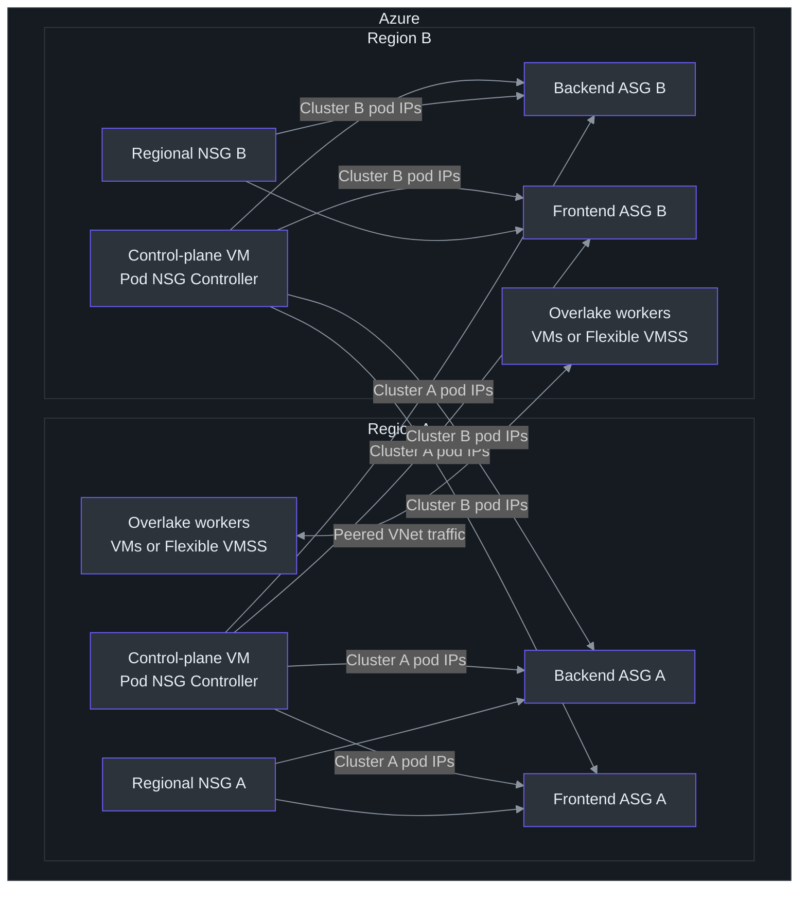
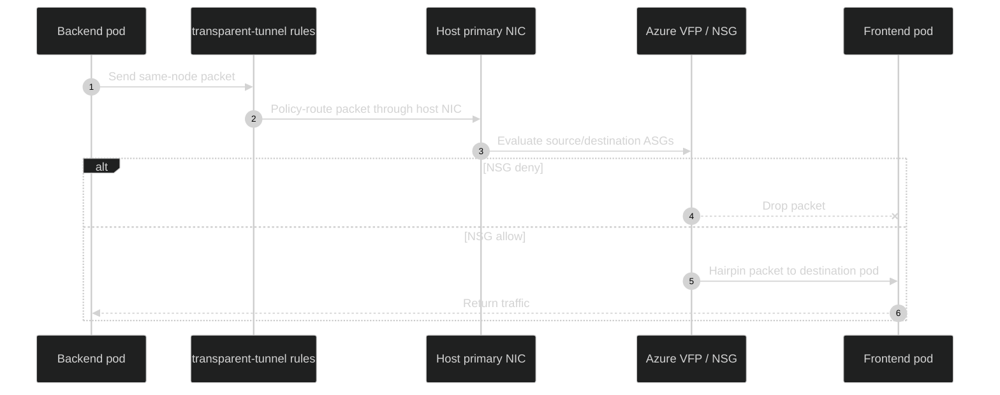
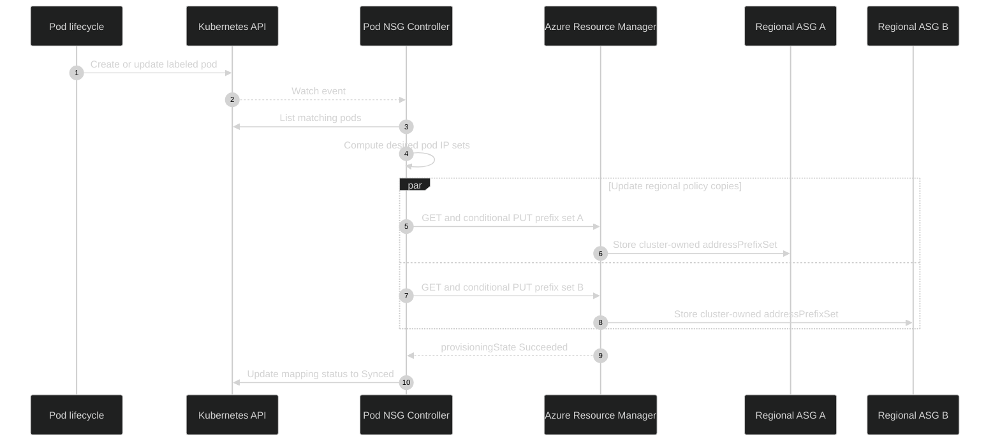
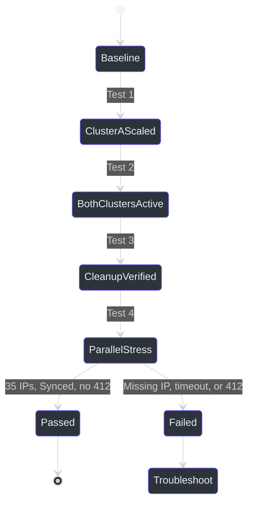

# Multi-Cluster Pod NSG Controller on Overlake VMs and VMSS

> [!IMPORTANT]
> This is a **preview/test setup guide** for third-party customers. Build and
> publish a private Pod NSG Controller image with the repository `Makefile`.
> Official release pipelines and Microsoft Container Registry (MCR) images are
> being prepared and will follow shortly. Do not treat a private test image as a
> Microsoft-supported production release.

## Overview

This guide creates two self-managed Kubernetes clusters in different Azure
regions, deploys one Pod NSG Controller per cluster, configures Azure CNI
`transparent-tunnel` mode on worker nodes, and verifies that NSG rules backed by
controller-managed Application Security Group (ASG) address prefix sets enforce
policy across and within clusters.

The controller selects pods through `PodASGMapping` resources and writes each
cluster's pod IPs to deterministic ASG child resources named
`<cluster>-<namespace>-<mapping>`. The naming contract comes directly from
`model.OwnershipKey`, and the controller uses the Azure Network
`2025-07-01` API for address prefix set operations
([internal/model/ownership.go:3-5](https://github.com/Azure/pod-nsg-controller/blob/main/internal/model/ownership.go#L3-L5),
[internal/azure/address_prefix_set_client.go:21-25](https://github.com/Azure/pod-nsg-controller/blob/main/internal/azure/address_prefix_set_client.go#L21-L25)).

| Area | Customer choice | Recommended test configuration | Source |
|---|---|---|---|
| Regions | Any two regions where the approved Overlake SKU is enabled | Two distinct regions and non-overlapping VNets | [docs/multi-cluster-test-setup.md:84-91](https://github.com/Azure/pod-nsg-controller/blob/main/docs/multi-cluster-test-setup.md#L84-L91) |
| Worker compute | Standalone VMs or Flexible VMSS instances | One control-plane VM and three workers per cluster | [scripts/poc/setup-cluster-eastus2euap.sh:20-29](https://github.com/Azure/pod-nsg-controller/blob/main/scripts/poc/setup-cluster-eastus2euap.sh#L20-L29) |
| Controller image | Customer-built private image | One immutable tag per test run | [Makefile:56-66](https://github.com/Azure/pod-nsg-controller/blob/main/Makefile#L56-L66) |
| CNI | Azure CNI `transparent-tunnel` on workers | Keep the control plane on the baseline CNI | [docs/transparent-tunnel-same-node-enforcement-test.md:125-143](https://github.com/Azure/pod-nsg-controller/blob/main/docs/transparent-tunnel-same-node-enforcement-test.md#L125-L143) |
| Azure policy | Regional NSG and ASG pairs | Backend and frontend ASGs in each region | [docs/Comprehensive%20Design%20Document%20and%20User%20Guide%2020260407.md:107-116](https://github.com/Azure/pod-nsg-controller/blob/main/docs/Comprehensive%20Design%20Document%20and%20User%20Guide%2020260407.md#L107-L116) |
| Identity | Managed identity | `Network Contributor` at each policy resource group | [docs/Comprehensive%20Design%20Document%20and%20User%20Guide%2020260407.md:496-506](https://github.com/Azure/pod-nsg-controller/blob/main/docs/Comprehensive%20Design%20Document%20and%20User%20Guide%2020260407.md#L496-L506) |



<!-- Sources: docs/multi-cluster-test-setup.md:1-80, docs/Comprehensive Design Document and User Guide 20260407.md:107-116, docs/Comprehensive Design Document and User Guide 20260407.md:496-506 -->

## 1. Plan the Environment

### 1.1 Overlake SKU requirement

This repository does **not** define a public Overlake VM SKU name. Its checked-in
PoC scripts currently use `Standard_D4s_v5`
([scripts/poc/setup-cluster-eastus2euap.sh:20-29](https://github.com/Azure/pod-nsg-controller/blob/main/scripts/poc/setup-cluster-eastus2euap.sh#L20-L29)).
For this guide:

1. Obtain the exact **Overlake-enabled VM SKU** and eligible regions from your
   Microsoft account or engineering contact.
2. Confirm that the SKU is enabled in each subscription and region:

   ```bash
   az vm list-skus \
     --subscription "$SUBSCRIPTION_A" \
     --location "$REGION_A" \
     --size "$OVERLAKE_VM_SKU" \
     --all \
     --output table
   ```

3. Repeat the check for Cluster B's subscription and region.
4. Do not substitute another SKU if Overlake datapath behavior is part of the
   test acceptance criteria.

See the public
[`az vm list-skus`](https://learn.microsoft.com/cli/azure/vm#az-vm-list-skus)
reference for command options. Exact Overlake offer names and entitlement remain
subscription-specific and must be verified with Microsoft.

### 1.2 Define customer-specific values

Use lowercase cluster names. `CLUSTER_NAME` is required, and the controller
rejects uppercase names to avoid ownership-key collisions
([internal/config/config.go:67-74](https://github.com/Azure/pod-nsg-controller/blob/main/internal/config/config.go#L67-L74),
[internal/config/config.go:198-206](https://github.com/Azure/pod-nsg-controller/blob/main/internal/config/config.go#L198-L206)).

```bash
export SUBSCRIPTION_A="<cluster-a-subscription-id>"
export SUBSCRIPTION_B="<cluster-b-subscription-id>"
export REGION_A="<region-a>"
export REGION_B="<region-b>"
export CLUSTER_A="customer-a-${REGION_A,,}"
export CLUSTER_B="customer-b-${REGION_B,,}"
export RG_A="${CLUSTER_A}-rg"
export RG_B="${CLUSTER_B}-rg"
export OVERLAKE_VM_SKU="<approved-overlake-sku>"

export VNET_A_CIDR="10.40.0.0/16"
export SUBNET_A_CIDR="10.40.1.0/24"
export VNET_B_CIDR="10.50.0.0/16"
export SUBNET_B_CIDR="10.50.1.0/24"

export KUBECONFIG_A="$HOME/.kube/${CLUSTER_A}.yaml"
export KUBECONFIG_B="$HOME/.kube/${CLUSTER_B}.yaml"
```

> [!CAUTION]
> Use `--subscription` on every Azure CLI command. Multi-subscription setup is
> error-prone when it depends on mutable `az account set` state.

### 1.3 Choose VM or VMSS workers

| Model | Use when | Important behavior | Reference |
|---|---|---|---|
| Standalone VMs | You want the closest match to the repository PoC and easiest per-NIC IP configuration | Provision one control-plane VM and three worker VMs | [docs/self-managed-k8s-azure-cni-setup.md:150-181](https://github.com/Azure/pod-nsg-controller/blob/main/docs/self-managed-k8s-azure-cni-setup.md#L150-L181) |
| Flexible VMSS | You need scale-set grouping while retaining standard VM and NIC APIs | Keep autoscale disabled until worker bootstrap and CNI configuration are automated | [Microsoft Learn: VMSS orchestration modes](https://learn.microsoft.com/azure/virtual-machine-scale-sets/virtual-machine-scale-sets-orchestration-modes) |

Flexible orchestration is recommended here because its instances use standard VM
APIs and can be created with explicit names and network configurations. Microsoft
documents attaching a VM at creation time with `az vm create --vmss`
([Attach a VM to a Flexible VMSS](https://learn.microsoft.com/azure/virtual-machine-scale-sets/virtual-machine-scale-sets-attach-detach-vm)).

## 2. Create the Two Clusters

The detailed single-cluster bootstrap is in
[Self-Managed Kubernetes Cluster with Azure CNI](../self-managed-k8s-azure-cni-setup.md).
Repeat it once per cluster with non-overlapping address spaces. The repository's
PoC scripts show the complete resource order: resource group, NSG, VNet/subnet,
NAT gateway, NICs, secondary IPs, VMs, managed identities, Kubernetes, Azure CNI,
and kubeconfig export
([scripts/poc/setup-cluster-eastus2euap.sh:31-120](https://github.com/Azure/pod-nsg-controller/blob/main/scripts/poc/setup-cluster-eastus2euap.sh#L31-L120)).

```mermaid
%%{init: {'theme': 'dark'}}%%
flowchart LR
    A["Confirm Overlake SKU access"] --> B["Create regional RG, VNet, subnet, NSG, NAT"]
    B --> C{"Worker model"}
    C -->|"VM"| D["Create worker NICs and VMs"]
    C -->|"Flexible VMSS"| E["Create empty Flexible VMSS<br>Attach named worker VMs"]
    D --> F["Add Azure CNI secondary IP configurations"]
    E --> F
    F --> G["Install containerd, kubeadm, kubelet, kubectl"]
    G --> H["Initialize control plane and join workers"]
    H --> I["Install baseline Azure CNI"]
    I --> J["Install transparent-tunnel on workers"]
    J --> K["Retrieve and verify kubeconfig"]

    style A fill:#2d333b,stroke:#6d5dfc,color:#e6edf3
    style B fill:#2d333b,stroke:#6d5dfc,color:#e6edf3
    style C fill:#2d333b,stroke:#6d5dfc,color:#e6edf3
    style D fill:#2d333b,stroke:#6d5dfc,color:#e6edf3
    style E fill:#2d333b,stroke:#6d5dfc,color:#e6edf3
    style F fill:#2d333b,stroke:#6d5dfc,color:#e6edf3
    style G fill:#2d333b,stroke:#6d5dfc,color:#e6edf3
    style H fill:#2d333b,stroke:#6d5dfc,color:#e6edf3
    style I fill:#2d333b,stroke:#6d5dfc,color:#e6edf3
    style J fill:#2d333b,stroke:#6d5dfc,color:#e6edf3
    style K fill:#2d333b,stroke:#6d5dfc,color:#e6edf3
    linkStyle default stroke:#8b949e
```



<!-- Sources: scripts/poc/setup-cluster-eastus2euap.sh:31-120, docs/self-managed-k8s-azure-cni-setup.md:150-310, docs/transparent-tunnel-same-node-enforcement-test.md:125-203 -->

### 2.1 Standalone VM workers

Follow the existing cluster guide, replacing `Standard_D4s_v5` with
`$OVERLAKE_VM_SKU` and adding `--subscription` explicitly:

```bash
az vm create \
  --subscription "$SUBSCRIPTION_A" \
  --resource-group "$RG_A" \
  --name "${CLUSTER_A}-worker-01" \
  --nics "${CLUSTER_A}-worker-01-nic" \
  --image "Canonical:0001-com-ubuntu-server-jammy:22_04-lts-gen2:latest" \
  --size "$OVERLAKE_VM_SKU" \
  --admin-username azureuser \
  --assign-identity \
  --generate-ssh-keys
```

Repeat for each worker and for Cluster B.

### 2.2 Flexible VMSS workers

Create a Flexible scale set for organization and lifecycle management, then
attach named worker VMs. Keep the control plane as a standalone VM.

```bash
export VMSS_A="${CLUSTER_A}-workers"

az vmss create \
  --subscription "$SUBSCRIPTION_A" \
  --resource-group "$RG_A" \
  --name "$VMSS_A" \
  --orchestration-mode Flexible \
  --platform-fault-domain-count 1 \
  --instance-count 0 \
  --vnet-name "${CLUSTER_A}-vnet" \
  --subnet "${CLUSTER_A}-subnet" \
  --nsg "${CLUSTER_A}-nsg" \
  --image "Canonical:0001-com-ubuntu-server-jammy:22_04-lts-gen2:latest" \
  --vm-sku "$OVERLAKE_VM_SKU" \
  --admin-username azureuser \
  --generate-ssh-keys

for i in 01 02 03; do
  az vm create \
    --subscription "$SUBSCRIPTION_A" \
    --resource-group "$RG_A" \
    --name "${CLUSTER_A}-worker-${i}" \
    --vmss "$VMSS_A" \
    --nics "${CLUSTER_A}-worker-${i}-nic" \
    --image "Canonical:0001-com-ubuntu-server-jammy:22_04-lts-gen2:latest" \
    --size "$OVERLAKE_VM_SKU" \
    --admin-username azureuser \
    --assign-identity \
    --generate-ssh-keys
done
```

Repeat for Cluster B. Add the secondary IP configurations required by Azure CNI
to each worker NIC **sequentially**, because the existing setup guide records ARM
conflicts when multiple IP configurations are added concurrently to one NIC
([docs/self-managed-k8s-azure-cni-setup.md:118-146](https://github.com/Azure/pod-nsg-controller/blob/main/docs/self-managed-k8s-azure-cni-setup.md#L118-L146)).

> [!WARNING]
> Do not enable VMSS autoscale yet. A new instance must receive Kubernetes
> prerequisites, the kubeadm join command, Azure CNI binaries and conflist,
> transparent-tunnel configuration, secondary IP configurations, managed
> identity, and RBAC before it can safely host pods. Automate those operations in
> an image or VM extension before enabling scale-out.

### 2.3 Peer the VNets

Create bidirectional global VNet peering if the regions differ:

```bash
VNET_A_ID=$(az network vnet show --subscription "$SUBSCRIPTION_A" \
  -g "$RG_A" -n "${CLUSTER_A}-vnet" --query id -o tsv)
VNET_B_ID=$(az network vnet show --subscription "$SUBSCRIPTION_B" \
  -g "$RG_B" -n "${CLUSTER_B}-vnet" --query id -o tsv)

az network vnet peering create --subscription "$SUBSCRIPTION_A" \
  -g "$RG_A" --vnet-name "${CLUSTER_A}-vnet" \
  -n "${CLUSTER_A}-to-${CLUSTER_B}" \
  --remote-vnet "$VNET_B_ID" --allow-vnet-access

az network vnet peering create --subscription "$SUBSCRIPTION_B" \
  -g "$RG_B" --vnet-name "${CLUSTER_B}-vnet" \
  -n "${CLUSTER_B}-to-${CLUSTER_A}" \
  --remote-vnet "$VNET_A_ID" --allow-vnet-access
```

## 3. Install Azure CNI Transparent-Tunnel

First complete the baseline Azure CNI setup and verify that every node is
`Ready`. The checked-in setup guide installs Azure CNI and documents the
transparent networking prerequisites
([docs/self-managed-k8s-azure-cni-setup.md:228-310](https://github.com/Azure/pod-nsg-controller/blob/main/docs/self-managed-k8s-azure-cni-setup.md#L228-L310)).

Then install the Microsoft-provided `transparent-tunnel` `azure-vnet` binary and
`azure-linux-transparent-tunnel.conflist` on **worker nodes only**. The repository
test guide intentionally keeps their URLs as placeholders so credentials such as
SAS tokens are never committed
([docs/transparent-tunnel-same-node-enforcement-test.md:125-143](https://github.com/Azure/pod-nsg-controller/blob/main/docs/transparent-tunnel-same-node-enforcement-test.md#L125-L143)).

```bash
export CNI_BINARY_URL="<private-transparent-tunnel-azure-vnet-url>"
export CNI_CONFLIST_URL="<private-transparent-tunnel-conflist-url>"
export CNI_BINARY_SHA256="<sha256-provided-with-the-artifact>"

cat > /tmp/install-transparent-tunnel.sh <<'EOF'
set -euo pipefail
: "${CNI_BINARY_URL:?}"
: "${CNI_CONFLIST_URL:?}"
: "${CNI_BINARY_SHA256:?}"

timestamp="$(date +%Y%m%d-%H%M%S)"
backup="/opt/cni/tt-backup-${timestamp}"
mkdir -p "$backup"
cp -a /opt/cni/bin/azure-vnet "$backup/" 2>/dev/null || true
cp -a /etc/cni/net.d/*.conflist "$backup/" 2>/dev/null || true

curl -fsSL "$CNI_BINARY_URL" -o /opt/cni/bin/azure-vnet.new
echo "${CNI_BINARY_SHA256}  /opt/cni/bin/azure-vnet.new" | sha256sum -c -
chmod 0755 /opt/cni/bin/azure-vnet.new
mv /opt/cni/bin/azure-vnet.new /opt/cni/bin/azure-vnet

curl -fsSL "$CNI_CONFLIST_URL" -o /etc/cni/net.d/10-azure.conflist
grep -Eq '"mode"[[:space:]]*:[[:space:]]*"transparent-tunnel"' \
  /etc/cni/net.d/10-azure.conflist

systemctl restart kubelet
systemctl is-active --quiet kubelet
EOF
```

Run the script through the standard VM API for every worker. This works for both
standalone VMs and Flexible VMSS instances:

```bash
install_tt_on_cluster() {
  local subscription="$1"
  local resource_group="$2"
  local cluster_name="$3"
  local payload="/tmp/${cluster_name}-transparent-tunnel.sh"

  {
    printf 'export CNI_BINARY_URL=%q\n' "$CNI_BINARY_URL"
    printf 'export CNI_CONFLIST_URL=%q\n' "$CNI_CONFLIST_URL"
    printf 'export CNI_BINARY_SHA256=%q\n' "$CNI_BINARY_SHA256"
    cat /tmp/install-transparent-tunnel.sh
  } > "$payload"

  for i in 01 02 03; do
    az vm run-command invoke \
      --subscription "$subscription" \
      --resource-group "$resource_group" \
      --name "${cluster_name}-worker-${i}" \
      --command-id RunShellScript \
      --scripts "@${payload}" \
      --query 'value[0].message' -o tsv
  done

  rm -f "$payload"
}

install_tt_on_cluster "$SUBSCRIPTION_A" "$RG_A" "$CLUSTER_A"
install_tt_on_cluster "$SUBSCRIPTION_B" "$RG_B" "$CLUSTER_B"
```

Keep the control-plane node on the baseline CNI because the checked-in
controller deployment selects the control-plane node
([config/manager/manager.yaml:34-43](https://github.com/Azure/pod-nsg-controller/blob/main/config/manager/manager.yaml#L34-L43)).

For VMSS, make this installation persistent through your base image or a VM
extension. A one-time modification is lost when instances are reimaged or
replaced.



<!-- Sources: docs/transparent-tunnel-same-node-enforcement-test.md:40-48, docs/transparent-tunnel-same-node-enforcement-test.md:88-103, docs/transparent-tunnel-same-node-enforcement-test.md:294-318 -->

Verify every worker:

```bash
grep -R '"mode": *"transparent-tunnel"' /etc/cni/net.d
systemctl is-active kubelet
ip rule show
ip route show table all
```

## 4. Build and Push a Private Controller Image

The current `Makefile` builds and pushes the image selected by `IMG`
([Makefile:56-70](https://github.com/Azure/pod-nsg-controller/blob/main/Makefile#L56-L70)).
The current Dockerfile produces a Linux AMD64, nonroot distroless image
([Dockerfile:1-16](https://github.com/Azure/pod-nsg-controller/blob/main/Dockerfile#L1-L16)).

```bash
export ACR_NAME="<customer-acr-name>"
export IMAGE_TAG="multicluster-$(date -u +%Y%m%d%H%M%S)"
export ACR_LOGIN_SERVER=$(az acr show \
  --subscription "$SUBSCRIPTION_A" \
  --name "$ACR_NAME" \
  --query loginServer -o tsv)
export CONTROLLER_IMAGE="${ACR_LOGIN_SERVER}/pod-nsg-controller:${IMAGE_TAG}"
export ACR_PULL_USERNAME="<scoped-acr-token-or-service-principal-id>"
export ACR_PULL_PASSWORD="<scoped-acr-token-or-service-principal-secret>"

az acr login --subscription "$SUBSCRIPTION_A" --name "$ACR_NAME"
make docker-build IMG="$CONTROLLER_IMAGE"
make docker-push IMG="$CONTROLLER_IMAGE"
```

Record the immutable digest:

```bash
az acr repository show \
  --subscription "$SUBSCRIPTION_A" \
  --name "$ACR_NAME" \
  --image "pod-nsg-controller:${IMAGE_TAG}" \
  --query digest -o tsv
```

Use the same immutable image in both clusters. Do not rebuild independently per
cluster. The checked-in Dockerfile currently builds `linux/amd64`; verify that
the selected Overlake-enabled SKU uses the AMD64 architecture.

## 5. Configure Azure Identity and RBAC

The controller uses a subscription-scoped client factory and resolves Azure
credentials through `DefaultAzureCredential`; an optional wireserver identity
path exists for environments where IMDS returns `410`
([internal/azure/client_factory.go:135-183](https://github.com/Azure/pod-nsg-controller/blob/main/internal/azure/client_factory.go#L135-L183)).

Grant the managed identity of the node that hosts the controller
`Network Contributor` on every resource group containing an ASG that the
cluster's mappings reference. The multi-cluster PoC applies a mesh of role
assignments so every cluster can update every target resource group
([scripts/poc/setup-cross-sub-rbac.sh:46-99](https://github.com/Azure/pod-nsg-controller/blob/main/scripts/poc/setup-cross-sub-rbac.sh#L46-L99)).

```bash
CP_A_PRINCIPAL=$(az vm identity show --subscription "$SUBSCRIPTION_A" \
  -g "$RG_A" -n "${CLUSTER_A}-cp-01" --query principalId -o tsv)
CP_B_PRINCIPAL=$(az vm identity show --subscription "$SUBSCRIPTION_B" \
  -g "$RG_B" -n "${CLUSTER_B}-cp-01" --query principalId -o tsv)

for principal in "$CP_A_PRINCIPAL" "$CP_B_PRINCIPAL"; do
  az role assignment create --subscription "$SUBSCRIPTION_A" \
    --assignee-object-id "$principal" \
    --assignee-principal-type ServicePrincipal \
    --role "Network Contributor" \
    --scope "/subscriptions/${SUBSCRIPTION_A}/resourceGroups/${RG_A}"

  az role assignment create --subscription "$SUBSCRIPTION_B" \
    --assignee-object-id "$principal" \
    --assignee-principal-type ServicePrincipal \
    --role "Network Contributor" \
    --scope "/subscriptions/${SUBSCRIPTION_B}/resourceGroups/${RG_B}"
done
```

If the controller cannot acquire an IMDS token, add the pod-to-IMDS masquerade
rule described in
[Cross-Subscription ASG Access](../cross-subscription-pod-asg-access.md#43-configure-imds-access-for-pods-iptables-masquerade),
or set `USE_WIRESERVER_IDENTITY=true` after verifying the wireserver endpoint in
your environment.

## 6. Create Regional ASGs and NSG Rules

NSGs cannot reference ASGs defined in another subscription or region. Create a
backend/frontend ASG pair in each region, then map workloads to all regional
copies that must know about those pod IPs
([docs/Comprehensive%20Design%20Document%20and%20User%20Guide%2020260407.md:107-116](https://github.com/Azure/pod-nsg-controller/blob/main/docs/Comprehensive%20Design%20Document%20and%20User%20Guide%2020260407.md#L107-L116)).

```bash
for entry in \
  "$SUBSCRIPTION_A $RG_A $REGION_A" \
  "$SUBSCRIPTION_B $RG_B $REGION_B"; do
  read -r subscription rg region <<<"$entry"

  az network asg create --subscription "$subscription" \
    -g "$rg" -n asg-backend --location "$region"
  az network asg create --subscription "$subscription" \
    -g "$rg" -n asg-frontend --location "$region"
done
```

Add the directional rules to each regional NSG:

```bash
BACKEND_ASG_A="/subscriptions/${SUBSCRIPTION_A}/resourceGroups/${RG_A}/providers/Microsoft.Network/applicationSecurityGroups/asg-backend"
FRONTEND_ASG_A="/subscriptions/${SUBSCRIPTION_A}/resourceGroups/${RG_A}/providers/Microsoft.Network/applicationSecurityGroups/asg-frontend"
BACKEND_ASG_B="/subscriptions/${SUBSCRIPTION_B}/resourceGroups/${RG_B}/providers/Microsoft.Network/applicationSecurityGroups/asg-backend"
FRONTEND_ASG_B="/subscriptions/${SUBSCRIPTION_B}/resourceGroups/${RG_B}/providers/Microsoft.Network/applicationSecurityGroups/asg-frontend"

az network nsg rule create --subscription "$SUBSCRIPTION_A" \
  -g "$RG_A" --nsg-name "${CLUSTER_A}-nsg" \
  -n DenyBackendToFrontend --priority 190 --access Deny \
  --direction Inbound --protocol '*' \
  --source-asgs "$BACKEND_ASG_A" --destination-asgs "$FRONTEND_ASG_A" \
  --source-port-ranges '*' --destination-port-ranges '*'

az network nsg rule create --subscription "$SUBSCRIPTION_A" \
  -g "$RG_A" --nsg-name "${CLUSTER_A}-nsg" \
  -n AllowFrontendToBackend --priority 200 --access Allow \
  --direction Inbound --protocol Tcp \
  --source-asgs "$FRONTEND_ASG_A" --destination-asgs "$BACKEND_ASG_A" \
  --source-port-ranges '*' --destination-port-ranges 8080
```

Repeat those two rules for Cluster B using its regional ASGs and NSG. The
directional rule pattern matches the transparent-tunnel enforcement test
([docs/transparent-tunnel-same-node-enforcement-test.md:104-119](https://github.com/Azure/pod-nsg-controller/blob/main/docs/transparent-tunnel-same-node-enforcement-test.md#L104-L119)).

## 7. Deploy Pod NSG Controller to Both Clusters

The checked-in deployment runs one nonroot controller with leader election,
health probes, a read-only root filesystem, and a control-plane node selector
([config/manager/manager.yaml:18-98](https://github.com/Azure/pod-nsg-controller/blob/main/config/manager/manager.yaml#L18-L98)).
Its service account can watch pods/nodes and update `PodASGMapping` status and
finalizers
([config/rbac/rbac.yaml:1-52](https://github.com/Azure/pod-nsg-controller/blob/main/config/rbac/rbac.yaml#L1-L52)).

Run the following function for each cluster:

```bash
deploy_controller() {
  local kubeconfig="$1"
  local cluster_name="$2"
  local subscription="$3"
  local resource_group="$4"
  local nsg_name="$5"

  kubectl --kubeconfig "$kubeconfig" create namespace pod-nsg-controller-system \
    --dry-run=client -o yaml | kubectl --kubeconfig "$kubeconfig" apply -f -

  kubectl --kubeconfig "$kubeconfig" apply -f config/crd/podasgmapping.yaml
  kubectl --kubeconfig "$kubeconfig" apply -f config/rbac/rbac.yaml

  kubectl --kubeconfig "$kubeconfig" -n pod-nsg-controller-system \
    create secret generic pod-nsg-controller-azure \
    --from-literal=subscription-id="$subscription" \
    --from-literal=resource-group="$resource_group" \
    --from-literal=nsg-name="$nsg_name" \
    --dry-run=client -o yaml | kubectl --kubeconfig "$kubeconfig" apply -f -

  # Use a scoped ACR token or service-principal credential. Do not use a
  # long-lived registry admin credential for a shared environment.
  kubectl --kubeconfig "$kubeconfig" -n pod-nsg-controller-system \
    create secret docker-registry customer-acr \
    --docker-server="$ACR_LOGIN_SERVER" \
    --docker-username="$ACR_PULL_USERNAME" \
    --docker-password="$ACR_PULL_PASSWORD" \
    --dry-run=client -o yaml | kubectl --kubeconfig "$kubeconfig" apply -f -

  kubectl --kubeconfig "$kubeconfig" -n pod-nsg-controller-system \
    patch serviceaccount pod-nsg-controller --type=merge \
    -p '{"imagePullSecrets":[{"name":"customer-acr"}]}'

  kubectl --kubeconfig "$kubeconfig" apply -f config/manager/manager.yaml
  kubectl --kubeconfig "$kubeconfig" -n pod-nsg-controller-system \
    set image deployment/pod-nsg-controller manager="$CONTROLLER_IMAGE"
  kubectl --kubeconfig "$kubeconfig" -n pod-nsg-controller-system \
    set env deployment/pod-nsg-controller \
    CLUSTER_NAME="$cluster_name"
  kubectl --kubeconfig "$kubeconfig" -n pod-nsg-controller-system \
    patch deployment pod-nsg-controller --type=strategic \
    -p '{"spec":{"template":{"spec":{"containers":[{"name":"manager","imagePullPolicy":"Always"}]}}}}'

  kubectl --kubeconfig "$kubeconfig" -n pod-nsg-controller-system \
    rollout status deployment/pod-nsg-controller --timeout=5m
}

deploy_controller "$KUBECONFIG_A" "$CLUSTER_A" "$SUBSCRIPTION_A" "$RG_A" "${CLUSTER_A}-nsg"
deploy_controller "$KUBECONFIG_B" "$CLUSTER_B" "$SUBSCRIPTION_B" "$RG_B" "${CLUSTER_B}-nsg"
```

## 8. Create Multi-Region Pod-to-ASG Mappings

The CRD supports a pod label selector and one or more full ASG resource IDs
([api/v1alpha1/types.go:25-60](https://github.com/Azure/pod-nsg-controller/blob/main/api/v1alpha1/types.go#L25-L60)).
Apply the same mapping to both clusters so each controller writes its local pod
IPs into the ASG copies used by both regional NSGs.

```bash
cat > /tmp/pod-asg-mappings.yaml <<EOF
apiVersion: networking.azure.com/v1alpha1
kind: PodASGMapping
metadata:
  name: backend-asg-mapping
  namespace: test-apps
spec:
  mappings:
    - podSelector:
        matchLabels:
          app: backend
      applicationSecurityGroups:
        - resourceId: ${BACKEND_ASG_A}
        - resourceId: ${BACKEND_ASG_B}
---
apiVersion: networking.azure.com/v1alpha1
kind: PodASGMapping
metadata:
  name: frontend-asg-mapping
  namespace: test-apps
spec:
  mappings:
    - podSelector:
        matchLabels:
          app: frontend
      applicationSecurityGroups:
        - resourceId: ${FRONTEND_ASG_A}
        - resourceId: ${FRONTEND_ASG_B}
EOF

for kubeconfig in "$KUBECONFIG_A" "$KUBECONFIG_B"; do
  kubectl --kubeconfig "$kubeconfig" create namespace test-apps \
    --dry-run=client -o yaml | kubectl --kubeconfig "$kubeconfig" apply -f -
  kubectl --kubeconfig "$kubeconfig" apply -f /tmp/pod-asg-mappings.yaml
done
```



<!-- Sources: api/v1alpha1/types.go:25-76, internal/controller/mapping_reconciler.go:220-360, internal/azure/address_prefix_set_client.go:99-145, docs/Comprehensive Design Document and User Guide 20260407.md:496-506 -->

## 9. Deploy Test Workloads

Apply this workload to both clusters:

```bash
cat > /tmp/test-workloads.yaml <<'EOF'
apiVersion: apps/v1
kind: Deployment
metadata:
  name: backend
  namespace: test-apps
spec:
  replicas: 2
  selector:
    matchLabels:
      app: backend
  template:
    metadata:
      labels:
        app: backend
    spec:
      containers:
        - name: server
          image: mendhak/http-https-echo:37
          env:
            - name: HTTP_PORT
              value: "8080"
---
apiVersion: apps/v1
kind: Deployment
metadata:
  name: frontend
  namespace: test-apps
spec:
  replicas: 2
  selector:
    matchLabels:
      app: frontend
  template:
    metadata:
      labels:
        app: frontend
    spec:
      containers:
        - name: client
          image: curlimages/curl:8.5.0
          command: ["sleep", "infinity"]
EOF

kubectl --kubeconfig "$KUBECONFIG_A" apply -f /tmp/test-workloads.yaml
kubectl --kubeconfig "$KUBECONFIG_B" apply -f /tmp/test-workloads.yaml
```

For controlled environments, mirror and digest-pin these fixture images in your
private registry.

## 10. Verify the Multi-Cluster Setup

The repository test guide defines four acceptance scenarios: single-cluster
scale-up, concurrent writes, scale-down cleanup, and parallel scale-up to 35
pods
([docs/multi-cluster-test-setup.md:143-228](https://github.com/Azure/pod-nsg-controller/blob/main/docs/multi-cluster-test-setup.md#L143-L228)).

### 10.1 Health and status

```bash
for kubeconfig in "$KUBECONFIG_A" "$KUBECONFIG_B"; do
  kubectl --kubeconfig "$kubeconfig" get nodes
  kubectl --kubeconfig "$kubeconfig" -n pod-nsg-controller-system \
    get pods -o wide
  kubectl --kubeconfig "$kubeconfig" -n test-apps \
    get podasgmappings \
    -o jsonpath='{range .items[*]}{.metadata.name}{"\n"}{range .status.mappingStatuses[*]}{"  state="}{.asgSyncState}{" matchedPods="}{.matchedPods}{" error="}{.error}{"\n"}{end}{end}'
  kubectl --kubeconfig "$kubeconfig" -n test-apps \
    get pods -o custom-columns='NAME:.metadata.name,IP:.status.podIP,APP:.metadata.labels.app,NODE:.spec.nodeName'
done
```

Both mappings must report `asgSyncState: Synced`, with `matchedPods` equal to the
number of selected pods.

### 10.2 Inspect regional ASG address prefix sets

```bash
inspect_asg() {
  local subscription="$1" rg="$2" asg="$3"
  az rest --method get \
    --url "https://management.azure.com/subscriptions/${subscription}/resourceGroups/${rg}/providers/Microsoft.Network/applicationSecurityGroups/${asg}/addressPrefixSets?api-version=2025-07-01" \
    --query 'value[].{name:name,prefixes:properties.addressPrefixSet,state:properties.provisioningState}' \
    -o jsonc
}

inspect_asg "$SUBSCRIPTION_A" "$RG_A" asg-backend
inspect_asg "$SUBSCRIPTION_A" "$RG_A" asg-frontend
inspect_asg "$SUBSCRIPTION_B" "$RG_B" asg-backend
inspect_asg "$SUBSCRIPTION_B" "$RG_B" asg-frontend
```

Each ASG should contain one prefix set per cluster. Prefix-set names are
deterministic, so concurrent controllers do not overwrite one another
([docs/multi-cluster-test-setup.md:126-135](https://github.com/Azure/pod-nsg-controller/blob/main/docs/multi-cluster-test-setup.md#L126-L135)).

### 10.3 Execute the four multi-cluster tests

| Test | Action | Pass criteria | Source |
|---|---|---|---|
| 1. Single-cluster scale-up | Scale Cluster A backend/frontend to five each | Exact ten Cluster A pod IPs in both regional ASG pairs; mappings `Synced` | [docs/multi-cluster-test-setup.md:143-163](https://github.com/Azure/pod-nsg-controller/blob/main/docs/multi-cluster-test-setup.md#L143-L163) |
| 2. Concurrent writes | Scale Cluster B backend/frontend to two each while Cluster A remains active | Two cluster-owned prefix sets per ASG; no `412 PreconditionFailed` logs | [docs/multi-cluster-test-setup.md:167-188](https://github.com/Azure/pod-nsg-controller/blob/main/docs/multi-cluster-test-setup.md#L167-L188) |
| 3. Cleanup | Scale Cluster A back to two each and Cluster B to zero | Remaining IPs are exact and stale Cluster B prefix sets are deleted | [docs/multi-cluster-test-setup.md:192-209](https://github.com/Azure/pod-nsg-controller/blob/main/docs/multi-cluster-test-setup.md#L192-L209) |
| 4. Parallel stress | Scale Cluster A to 13 backend/12 frontend and Cluster B to 5/5 in parallel | All 35 IPs converge across four cluster-owned prefix sets | [docs/multi-cluster-test-setup.md:213-228](https://github.com/Azure/pod-nsg-controller/blob/main/docs/multi-cluster-test-setup.md#L213-L228) |

```bash
# Test 1
kubectl --kubeconfig "$KUBECONFIG_A" -n test-apps scale deploy/backend --replicas=5
kubectl --kubeconfig "$KUBECONFIG_A" -n test-apps scale deploy/frontend --replicas=5

# Test 2
kubectl --kubeconfig "$KUBECONFIG_B" -n test-apps scale deploy/backend --replicas=2
kubectl --kubeconfig "$KUBECONFIG_B" -n test-apps scale deploy/frontend --replicas=2

# Search for concurrency failures
for kubeconfig in "$KUBECONFIG_A" "$KUBECONFIG_B"; do
  if kubectl --kubeconfig "$kubeconfig" -n pod-nsg-controller-system \
    logs deployment/pod-nsg-controller --since=30m |
    grep -Eqi '412|PreconditionFailed'; then
    echo "FAILED: ARM conflict found in $kubeconfig"
  else
    echo "PASS: no ARM conflict found in $kubeconfig"
  fi
done

# Test 3
kubectl --kubeconfig "$KUBECONFIG_A" -n test-apps scale deploy/backend --replicas=2
kubectl --kubeconfig "$KUBECONFIG_A" -n test-apps scale deploy/frontend --replicas=2
kubectl --kubeconfig "$KUBECONFIG_B" -n test-apps scale deploy/backend --replicas=0
kubectl --kubeconfig "$KUBECONFIG_B" -n test-apps scale deploy/frontend --replicas=0

# Test 4
kubectl --kubeconfig "$KUBECONFIG_A" -n test-apps scale deploy/backend --replicas=13 &
kubectl --kubeconfig "$KUBECONFIG_A" -n test-apps scale deploy/frontend --replicas=12 &
kubectl --kubeconfig "$KUBECONFIG_B" -n test-apps scale deploy/backend --replicas=5 &
kubectl --kubeconfig "$KUBECONFIG_B" -n test-apps scale deploy/frontend --replicas=5 &
wait
```



<!-- Sources: docs/multi-cluster-test-setup.md:139-228, scripts/poc/validate-poc.sh:1-20 -->

### 10.4 Verify transparent-tunnel enforcement

Follow the
[Transparent-Tunnel Same-Node Enforcement Test](../transparent-tunnel-same-node-enforcement-test.md)
to pin a backend and frontend pod to the same worker. Confirm:

- backend to frontend is denied;
- frontend to backend TCP/8080 is allowed;
- a pod outside both ASGs is not accidentally denied; and
- same-node traffic appears on the host primary NIC, proving the flow reached
  Azure VFP.

The expected packet-flow evidence is documented in the test guide
([docs/transparent-tunnel-same-node-enforcement-test.md:254-318](https://github.com/Azure/pod-nsg-controller/blob/main/docs/transparent-tunnel-same-node-enforcement-test.md#L254-L318)).

## 11. Troubleshooting

| Symptom | Likely cause | Corrective action | Source |
|---|---|---|---|
| Controller exits immediately | Missing or uppercase `CLUSTER_NAME` | Set a unique lowercase name on each deployment | [internal/config/config.go:198-206](https://github.com/Azure/pod-nsg-controller/blob/main/internal/config/config.go#L198-L206) |
| `ImagePullBackOff` | Private ACR secret missing or invalid | Recreate the scoped pull secret and patch the service account | [config/manager/manager.yaml:44-51](https://github.com/Azure/pod-nsg-controller/blob/main/config/manager/manager.yaml#L44-L51) |
| ARM `403` | Controller-node identity lacks target RG access | Grant `Network Contributor` on every referenced ASG resource group | [scripts/poc/setup-cross-sub-rbac.sh:70-99](https://github.com/Azure/pod-nsg-controller/blob/main/scripts/poc/setup-cross-sub-rbac.sh#L70-L99) |
| IMDS `410` | Pod source IP is not accepted by IMDS | Apply IMDS masquerade or test `USE_WIRESERVER_IDENTITY=true` | [internal/azure/client_factory.go:163-183](https://github.com/Azure/pod-nsg-controller/blob/main/internal/azure/client_factory.go#L163-L183) |
| CoreDNS or service routing fails | Baseline transparent networking is incomplete | Apply the bridge/L3/DNS fixes before transparent-tunnel | [docs/self-managed-k8s-azure-cni-setup.md:322-461](https://github.com/Azure/pod-nsg-controller/blob/main/docs/self-managed-k8s-azure-cni-setup.md#L322-L461) |
| Same-node deny is not enforced | Worker still uses baseline transparent mode or pods were not recreated | Verify conflist, restart kubelet, and recreate pods | [docs/transparent-tunnel-same-node-enforcement-test.md:365-380](https://github.com/Azure/pod-nsg-controller/blob/main/docs/transparent-tunnel-same-node-enforcement-test.md#L365-L380) |
| Repeated ARM `412` | Wrong/stale prefix-set ETag or overlapping ownership | Confirm distinct lowercase cluster names and inspect controller logs | [docs/multi-cluster-test-setup.md:167-188](https://github.com/Azure/pod-nsg-controller/blob/main/docs/multi-cluster-test-setup.md#L167-L188) |
| VMSS replacement loses CNI mode | Configuration was applied only to an instance | Bake the artifacts/config into the image or use a VM extension | [docs/transparent-tunnel-same-node-enforcement-test.md:125-203](https://github.com/Azure/pod-nsg-controller/blob/main/docs/transparent-tunnel-same-node-enforcement-test.md#L125-L203) |

## 12. Cleanup

Delete Kubernetes resources first so the controller can remove its prefix sets:

```bash
for kubeconfig in "$KUBECONFIG_A" "$KUBECONFIG_B"; do
  kubectl --kubeconfig "$kubeconfig" delete -f /tmp/test-workloads.yaml --ignore-not-found
  kubectl --kubeconfig "$kubeconfig" delete -f /tmp/pod-asg-mappings.yaml --ignore-not-found
done
```

Verify the cluster-owned address prefix sets are gone, then delete the test
resource groups:

```bash
az group delete --subscription "$SUBSCRIPTION_A" -n "$RG_A" --yes --no-wait
az group delete --subscription "$SUBSCRIPTION_B" -n "$RG_B" --yes --no-wait
```

## References

| Reference | Use |
|---|---|
| [Multi-cluster test setup](../multi-cluster-test-setup.md) | Original topology and four acceptance tests |
| [Self-managed Azure CNI setup](../self-managed-k8s-azure-cni-setup.md) | VM, kubeadm, Azure CNI, routing, and kubeconfig bootstrap |
| [Transparent-tunnel enforcement test](../transparent-tunnel-same-node-enforcement-test.md) | Worker CNI replacement and same-node policy proof |
| [Cross-subscription access](../cross-subscription-pod-asg-access.md) | Managed identity, IMDS, and cross-subscription ARM validation |
| [VMSS orchestration modes](https://learn.microsoft.com/azure/virtual-machine-scale-sets/virtual-machine-scale-sets-orchestration-modes) | Flexible versus Uniform VMSS behavior |
| [`az vm list-skus`](https://learn.microsoft.com/cli/azure/vm#az-vm-list-skus) | Region and subscription SKU availability |

## Related Pages

| Page | Relationship |
|---|---|
| [Multi-Cluster Test Setup](../multi-cluster-test-setup.md) | Defines the shared-ASG behavior and scale scenarios used by this guide |
| [Transparent-Tunnel Same-Node Enforcement](../transparent-tunnel-same-node-enforcement-test.md) | Provides the detailed packet-policy validation procedure |
| [Self-Managed Kubernetes with Azure CNI](../self-managed-k8s-azure-cni-setup.md) | Supplies the base cluster installation procedure |
| [Cross-Subscription Pod ASG Access](../cross-subscription-pod-asg-access.md) | Explains managed identity and ARM access across subscriptions |
